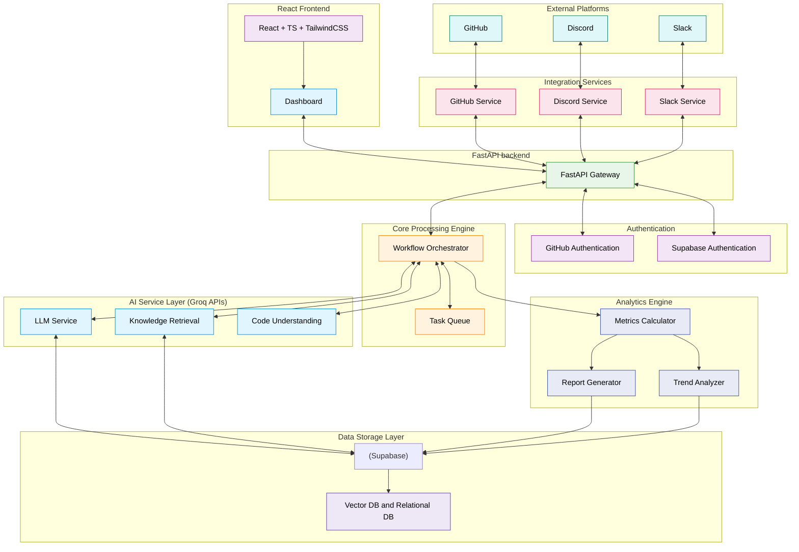
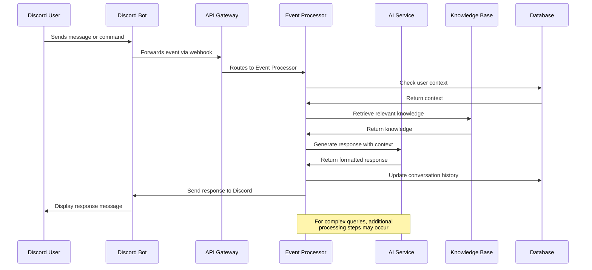
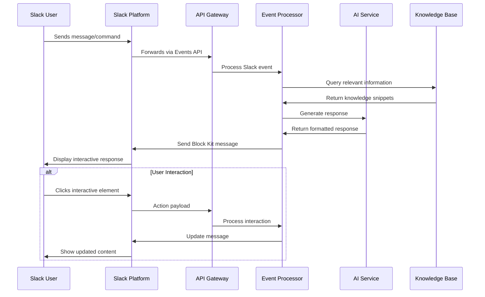
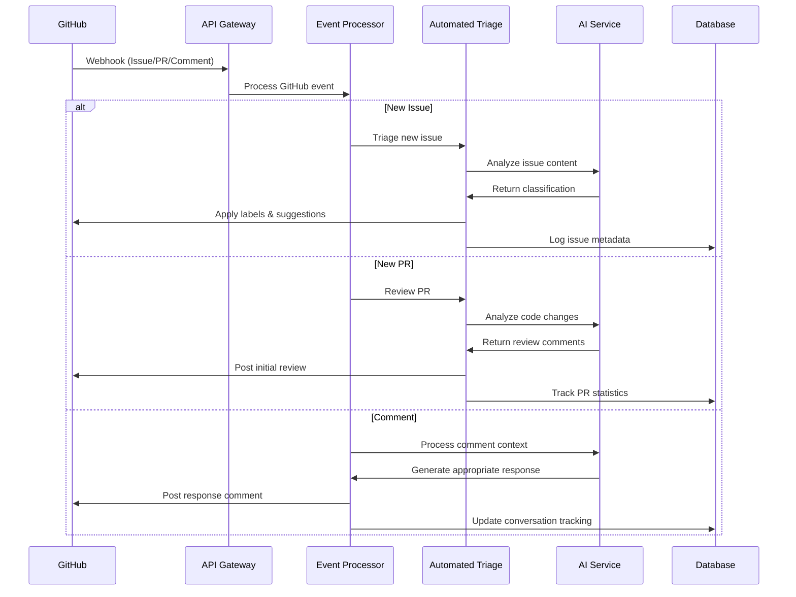
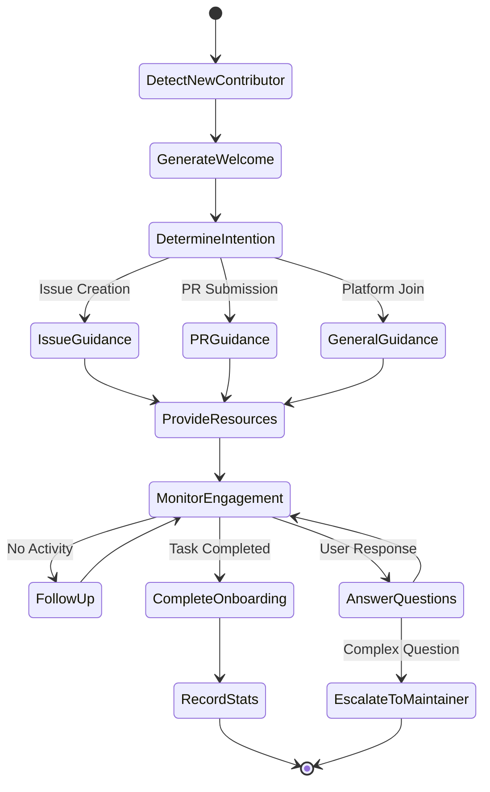
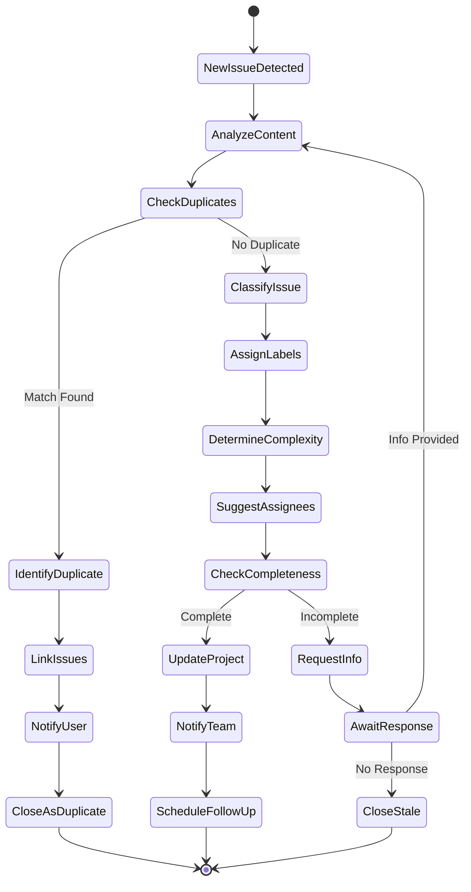
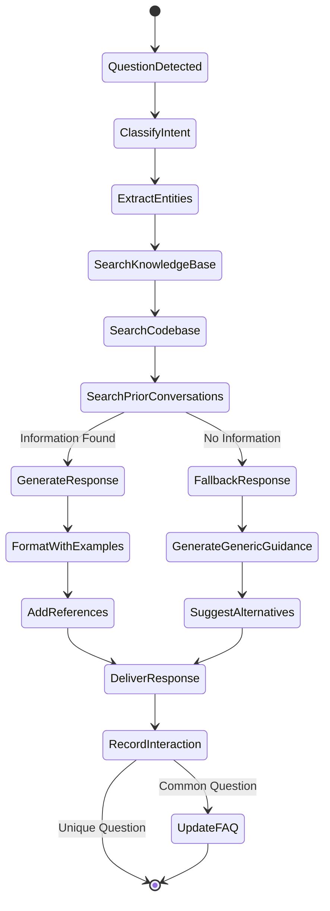
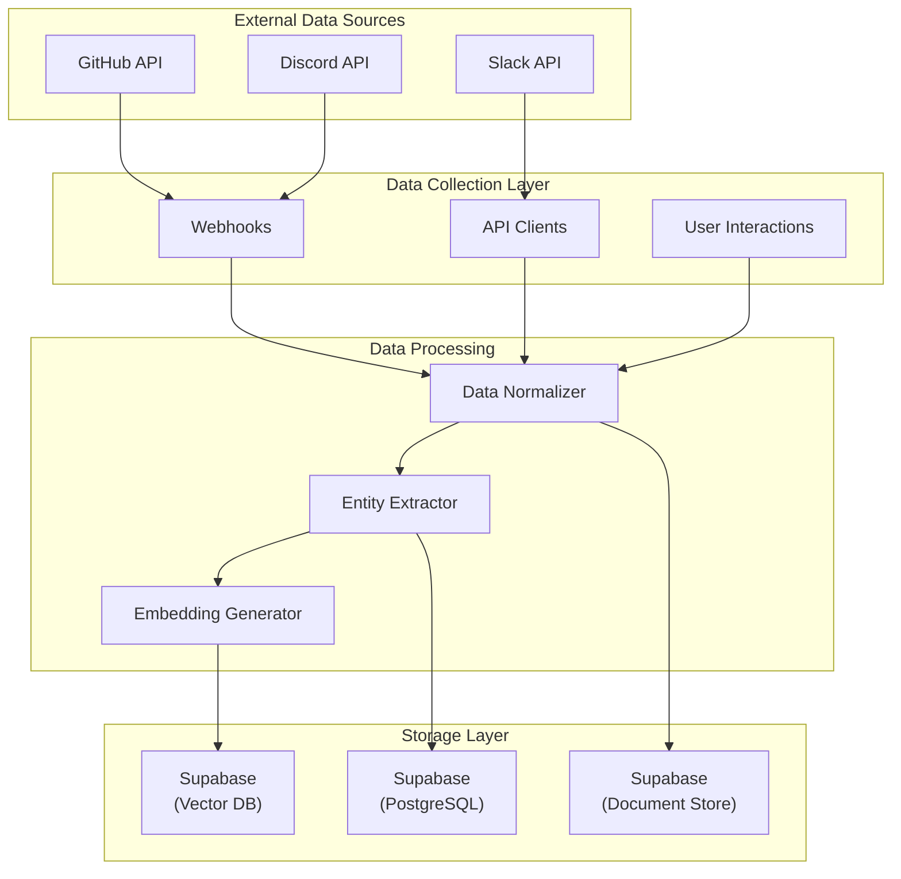
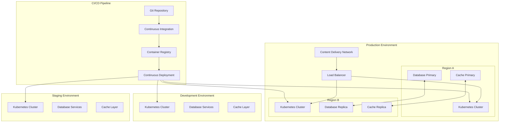

# Devr.AI - AI-Powered Developer Relations Assistant

## Table of Contents
- [Project Overview](#project-overview)
- [System Architecture](#system-architecture)
- [Setup Guide](#setup-guide)
- [Core Features](#core-features)
- [Technology Stack](#technology-stack)
- [Integration Details](#integration-details)
- [Workflows](#workflows)
- [Data Flow and Storage](#data-flow-and-storage)
- [Deployment Strategy](#deployment-strategy)

## Project Overview

Devr.AI is an advanced AI-powered Developer Relations (DevRel) assistant designed to revolutionize open-source community management. By integrating with platforms like Discord, Slack, GitHub, and Discourse, Devr.AI functions as a virtual DevRel advocate that helps maintainers engage with contributors, streamline onboarding processes, and deliver real-time project updates.

The system leverages Large Language Models (LLMs), knowledge retrieval mechanisms, and workflow automation to enhance community engagement, simplify contributor onboarding, and ensure that open-source projects remain active and well-supported.

### Key Value Propositions

- **Reduce maintainer workload** by automating routine interactions and queries
- **Improve contributor experience** through personalized onboarding and support
- **Enhance project visibility** via consistent engagement and community nurturing
- **Generate actionable insights** from community interactions and contribution patterns
- **Ensure knowledge preservation** by capturing and organizing project information

## System Architecture

### High-Level Architecture Overview

Devr.AI follows a microservices architecture with the following key components:

1. **API Gateway Layer**
   - Handles all incoming requests from integrated platforms
   - Manages authentication and request routing
   - Implements rate limiting and request validation

2. **Core Processing Engine**
   - Orchestrates workflows between different services
   - Manages the processing queue for asynchronous tasks
   - Handles context management for ongoing conversations

3. **AI Service Layer**
   - LLM integration for natural language understanding and generation
   - Knowledge retrieval system for accessing project-specific information
   - Specialized models for code understanding and issue triage

4. **Integration Services**
   - Platform-specific adapters for Discord, Slack, GitHub, and Discourse
   - Webhook handlers and event processors
   - Authentication managers for each platform

5. **Data Storage Layer**
   - Vector database for semantic search functionality
   - Relational database for structured data and relationships
   - Document store for conversation history and analytics

6. **Analytics Engine**
   - Real-time metrics calculation
   - Report generation
   - Anomaly detection and trend analysis

## Core Features

### 1. AI-Driven Contributor Engagement

- **New Contributor Welcome & Onboarding**
  - Automatic detection of first-time contributors
  - Personalized welcome messages with project-specific onboarding instructions
  - Interactive guidance through first contribution steps

- **Community Interaction**
  - Natural language conversations across all integrated platforms
  - Contextual responses based on user history and project knowledge
  - Multi-turn dialogue management with memory of previous interactions

- **Activity Promotion**
  - Automated suggestions for good first issues to new contributors
  - Regular updates about project milestones and achievements
  - Recognition of contributor achievements and milestones

### 2. Automated Issue Triage & PR Assistance

- **Issue Classification**
  - Automatic categorization of new issues by type, component, and priority
  - Identification of duplicate issues and linking them together
  - Suggested assignment based on contributor expertise and availability

- **PR Review Support**
  - Automated initial code review comments for common issues
  - Documentation verification and suggestions
  - Test coverage analysis and feedback

- **Contributor Guidance**
  - Step-by-step assistance for setting up development environments
  - Code style and convention explanations
  - Troubleshooting help for common development issues

### 3. Knowledge Base & FAQ Automation

- **Dynamic Documentation**
  - Automatic extraction of FAQs from community conversations
  - Creation and maintenance of project wikis and guides
  - Code documentation generation and enhancement

- **Contextual Help**
  - Instant answers to common technical questions
  - Project-specific knowledge retrieval
  - Code snippet explanations and examples

- **Knowledge Preservation**
  - Capturing of tribal knowledge from experienced contributors
  - Archiving of important decisions and their context
  - Historical project evolution tracking

### 4. AI-Powered Community Analytics

- **Engagement Metrics**
  - Contributor activity tracking across platforms
  - Response time and resolution rate monitoring
  - Community growth and retention analytics

- **Contribution Analysis**
  - Identification of valuable contributors and their patterns
  - Code quality and impact measurements
  - Diversity and inclusion metrics

- **Health Monitoring**
  - Early warning system for declining project activity
  - Burnout risk detection for maintainers
  - Community sentiment analysis

## Setup Guide
For installing the project locally refer to the [Installation Guide](./docs/INSTALL_GUIDE.md)

## Technology Stack

### Backend Services

- **Core Framework**: FastAPI
- **Containerization**: Docker & Kubernetes
- **Messaging Queue**: RabbitMQ
- **Task Scheduling**: Celery

### AI Components (Groq APIs)

- **LLM Integration**: Strong LLM with reasoning capacity
- **Embeddings**: Embedding Model

### Data Storage

- **Vector Database**: Supabase
- **Relational Database**: Supabase (PostgreSQL)
- **Document Storage**: Supabase

### Frontend Components

- **Dashboard**: React.js + Tailwind CSS
- **Analytics UI**: React.js + Shadcn

### DevOps & Infrastructure

- **CI/CD**: GitHub Actions
- **Monitoring**: Prometheus
- **Logging**: ELK Stack
- **Cloud Provider**: AWS / GCP

## Integration Details

### Discord Integration

#### Authentication & Setup
- OAuth2 flow for bot installation
- Server-specific configuration and permission setup
- Role-based access control configuration

#### Event Handling
- Message creation and update events
- Channel join/leave events
- Reaction events for issue tracking

#### Features
- Thread creation for complex discussions
- Slash commands for direct interaction with DevrAI
- Automated welcome messages in designated channels
- Role assignment based on GitHub contribution history

#### Data Flow
1. Discord webhook sends event to API Gateway
2. Event processor extracts relevant information
3. AI Service generates appropriate response
4. Integration service formats and sends response back to Discord

### Slack Integration

#### Authentication & Setup
- Slack App Directory installation flow
- Workspace-specific settings configuration
- Channel mapping to project components

#### Event Handling
- Message events in channels and direct messages
- App mention events
- Interactive component events (buttons, dropdowns)

#### Features
- Slash commands for project information
- Interactive message components for issue triage
- Automatic daily/weekly project updates
- Direct message onboarding for new contributors

#### Data Flow
1. Slack Events API sends event to API Gateway
2. Event processor validates and processes the event
3. Workflow engine determines appropriate action
4. Response is formatted according to Slack Block Kit
5. Message is sent back to appropriate Slack channel

### GitHub Integration

#### Authentication & Setup
- GitHub App installation process
- Repository-specific configuration
- Permission scopes management

#### Event Handling
- Issue creation, update, and comment events
- Pull request lifecycle events
- Repository star and fork events
- Release publication events

#### Features
- Automated issue labeling and assignment
- PR review comments and suggestions
- Release notes generation
- Contributor statistics and recognition

#### Data Flow
1. GitHub webhook sends event to API Gateway
2. Event processor categorizes and enriches event data
3. Task is assigned to appropriate service based on event type
4. Response actions are taken via GitHub API
5. Event and action are logged for analytics

### Discourse Integration

#### Authentication & Setup
- API key authentication
- Category and tag mapping
- User role configuration

#### Event Handling
- New topic creation events
- Post creation and update events
- User registration events

#### Features
- Automatic responses to common questions
- Cross-linking between forum topics and GitHub issues
- Knowledge base article suggestions
- Community showcase of project achievements

#### Data Flow
1. Discourse webhook or API polling detects new content
2. Content is processed and classified
3. Knowledge retrieval finds relevant information
4. Response is generated and posted to appropriate thread
5. New knowledge is extracted and stored for future use

## Workflows

### New Contributor Onboarding Workflow

1. **Trigger**: First-time contributor opens an issue or PR, or joins community platform
2. **Detection**: System identifies user as new contributor based on platform history
3. **Personalization**: AI generates personalized welcome message based on:
   - Contribution type (issue, PR, question)
   - Project area of interest
   - Technical background (if available)
4. **Guidance**: Provides specific next steps based on contribution intent:
   - Development environment setup instructions
   - Coding standards and guidelines
   - Testing requirements
   - Documentation expectations
5. **Follow-up**: Monitors engagement and provides additional assistance:
   - Answers to follow-up questions
   - Escalation to human maintainers when necessary
   - Check-ins on progress after predefined intervals

### Issue Triage Workflow

1. **Trigger**: New issue created on GitHub
2. **Analysis**:
   - AI extracts key information from issue description
   - Compares with existing issues for duplicates
   - Identifies affected components and potential severity
3. **Classification**:
   - Applies appropriate labels (bug, feature, documentation, etc.)
   - Assigns priority level
   - Suggests potential assignees based on expertise
4. **Enhancement**:
   - Requests additional information if description is incomplete
   - Suggests reproducible test cases if applicable
   - Provides links to relevant documentation
5. **Notification**:
   - Alerts appropriate team members in Slack/Discord
   - Updates project boards
   - Schedules follow-up if issue remains unaddressed

### Knowledge Query Workflow

1. **Trigger**: Question asked in any integrated platform
2. **Intent Recognition**:
   - Identifies question type and topic
   - Extracts key entities and concepts
3. **Knowledge Retrieval**:
   - Searches vector database for semantically similar content
   - Retrieves relevant documentation and past answers
   - Examines code repository for relevant examples
4. **Response Generation**:
   - Creates comprehensive yet concise answer
   - Includes code examples if appropriate
   - Adds links to official documentation
5. **Knowledge Capture**:
   - Records question and answer in knowledge base
   - Updates FAQ if question is common
   - Identifies documentation gaps for future improvement

### Community Analytics Workflow

1. **Data Collection**:
   - Continuous monitoring of activity across all platforms
   - Tracking of individual contributor actions
   - Recording of response times and resolution rates
2. **Processing**:
   - Aggregation of metrics by timeframe and category
   - Calculation of derived metrics (e.g., contributor retention)
   - Trend analysis and anomaly detection
3. **Insight Generation**:
   - Identification of active vs. declining areas
   - Recognition of valuable contributors
   - Detection of potential community issues
4. **Reporting**:
   - Automated weekly summaries to maintainers
   - Interactive dashboard updates
   - Quarterly comprehensive project health reports
5. **Action Recommendation**:
   - Suggestions for community engagement improvements
   - Identification of contributors for recognition
   - Alerts for areas needing maintainer attention

## Data Flow and Storage

### Data Collection and Processing

1. **External Data Sources**
   - Platform APIs (GitHub, Discord, Slack)
   - Webhook events
   - Direct user interactions

2. **Data Transformation**
   - Normalization of platform-specific data formats
   - Entity extraction and relationship mapping
   - Embedding generation for textual content

3. **Storage Destinations**
   - Vector embeddings → Pinecone
   - Structured relationships → Supabase
   - Historical conversations → MongoDB
   - Temporary state → Redis

## Deployment Strategy

### Infrastructure Architecture

- **Multi-environment Setup**:
  - Development environment for active feature development
  - Staging environment for integration testing
  - Production environment for live deployment

- **Containerized Deployment**:
  - Microservices packaged as Docker containers
  - Kubernetes for orchestration and scaling
  - Helm charts for deployment configuration

- **High Availability Design**:
  - Multiple replicas of critical services
  - Cross-zone deployment on cloud provider
  - Automatic failover mechanisms

### CI/CD Pipeline

1. **Code Integration**:
   - Pull request validation
   - Automated code quality checks
   - Unit test execution

2. **Build Process**:
   - Docker image building
   - Image vulnerability scanning
   - Artifact versioning

3. **Deployment Stages**:
   - Automated deployment to development
   - Manual approval for staging promotion
   - Canary deployment to production
   - Progressive rollout strategy

4. **Monitoring and Rollback**:
   - Health check validation post-deployment
   - Automatic rollback on critical metrics deviation
   - Deployment audit logging

