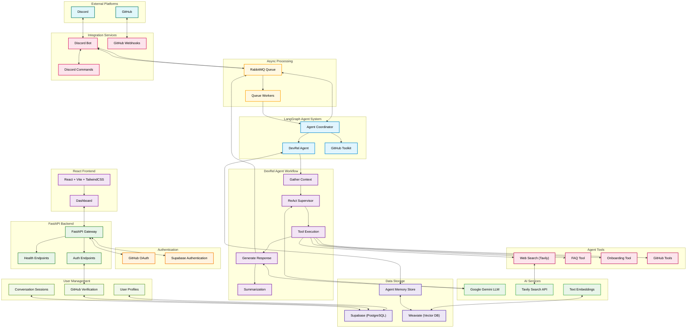
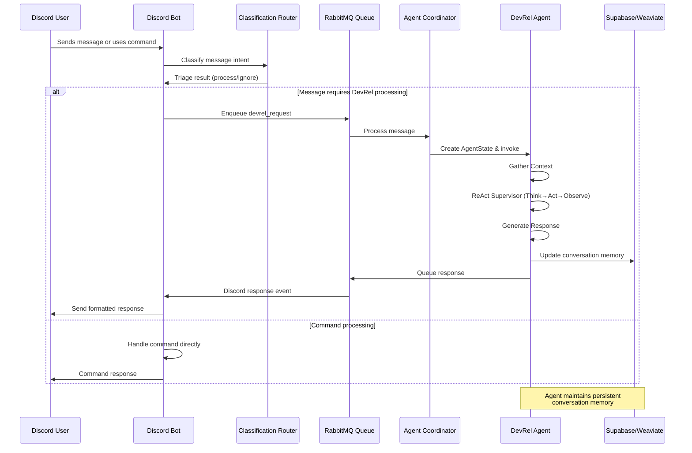
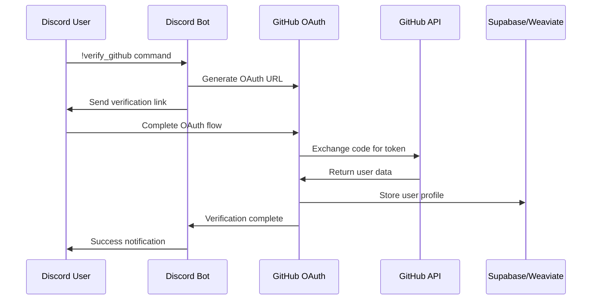
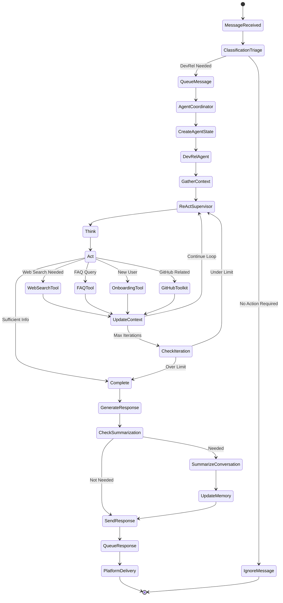
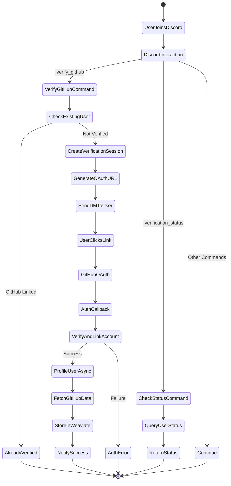
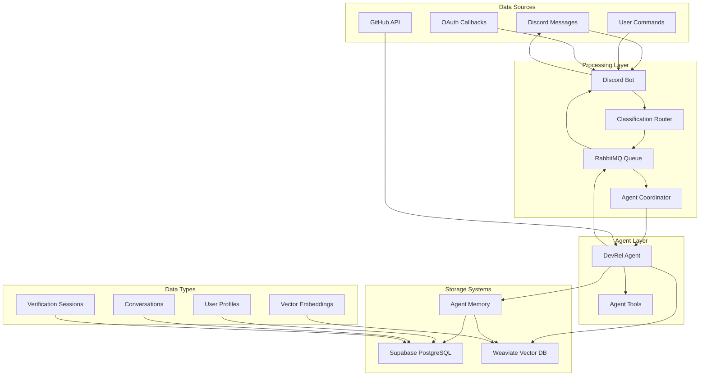

# Devr.AI - AI-Powered Developer Relations Assistant

## Table of Contents

-   [Project Overview](#project-overview)
-   [System Architecture](#system-architecture)
-   [Setup Guide](#setup-guide)
-   [Core Features](#core-features)
-   [Technology Stack](#technology-stack)
-   [Integration Details](#integration-details)
-   [Workflows](#workflows)
-   [Data Flow and Storage](#data-flow-and-storage)
-   [Planned Features & Roadmap](#planned-features--roadmap)
-   [Deployment Strategy](#deployment-strategy)

## Project Overview

Devr.AI is an advanced AI-powered Developer Relations (DevRel) assistant designed to revolutionize open-source community management. Currently integrating with Discord and GitHub, Devr.AI functions as a virtual DevRel advocate that helps maintainers engage with contributors, streamline onboarding processes, and deliver real-time project updates.

The system leverages Large Language Models (LLMs), knowledge retrieval mechanisms, and workflow automation to enhance community engagement, simplify contributor onboarding, and ensure that open-source projects remain active and well-supported.

Devr.AI bridges the gap between projects and their developer communities by providing technical education, creating engaging content, facilitating documentation access, and delivering personalized experiences that reduce maintainer workload while improving overall community satisfaction.

### Key Value Propositions

-   **Reduce maintainer workload** by automating routine interactions and queries
-   **Improve contributor experience** through personalized onboarding and support
-   **Enhance project visibility** via consistent engagement and community nurturing
-   **Generate actionable insights** from community interactions and contribution patterns
-   **Ensure knowledge preservation** by capturing and organizing project information
-   **Accelerate developer productivity** with interactive tutorials and code assistance
-   **Strengthen documentation** with AI-powered navigation and custom content generation

## System Architecture

### High-Level Architecture Overview

Devr.AI is built on a **LangGraph agent-based architecture** with autonomous, reasoning agents that can think, act, and observe. The system follows a **ReAct (Reasoning and Acting) pattern** for intelligent decision-making and tool usage.

#### **Core Architectural Components**

-   **LangGraph Agent System**

    -   **Agent Coordinator**: Central orchestrator that manages agent instances and handles routing between different specialized agents
    -   **DevRel Agent**: Primary conversational agent using ReAct workflow for community support and engagement
    -   **GitHub Toolkit**: Specialized agent for GitHub-specific operations and integrations

-   **ReAct Agent Workflow**

    -   **Gather Context**: Collects user information, conversation history, and platform-specific context
    -   **ReAct Supervisor**: Implements Think → Act → Observe pattern to decide which tools to use
    -   **Tool Execution**: Dynamically selects and executes appropriate tools (web search, FAQ, onboarding, GitHub operations)
    -   **Generate Response**: Synthesizes tool results into coherent, contextual responses
    -   **Summarization**: Maintains long-term conversation memory and context preservation

-   **Asynchronous Processing**

    -   **RabbitMQ Message Queue**: Handles high-throughput message processing with priority-based queuing
    -   **Queue Workers**: Multiple worker processes for parallel message handling and agent coordination
    -   **Background Tasks**: User profiling, verification flows, and maintenance operations

-   **AI Services Integration**

    -   **Google Gemini**: Primary LLM for reasoning, response generation, and conversation management
    -   **Tavily Search API**: Real-time web search and information retrieval
    -   **Text Embeddings**: Semantic search and knowledge retrieval from vector storage

-   **Platform Integrations**

    -   **Discord Bot**: Real-time community engagement with command support and conversation threads
    -   **GitHub Integration**: Webhook processing, issue triage, and repository analysis

-   **Data Storage Architecture**

    -   **Supabase (PostgreSQL)**: User profiles, authentication, conversation metadata, and structured data
    -   **Weaviate Vector Database**: Semantic search, embeddings storage, and knowledge retrieval
    -   **Agent Memory Store**: Persistent conversation context and user interaction history

-   **Authentication & User Management**
    -   **GitHub OAuth Integration**: User verification and repository access
    -   **Supabase Authentication**: Session management and user account linking
    -   **Multi-platform Identity**: Unified user profiles across Discord and GitHub

## Core Features

### 1. LangGraph Agent-Based Intelligence

-   **ReAct Reasoning Pattern**
    -   Think → Act → Observe workflow for intelligent decision making
    -   Dynamic tool selection based on conversation context
    -   Iterative problem-solving with self-correction capabilities

-   **Conversational Memory**
    -   Persistent conversation context across Discord sessions
    -   Automatic summarization after 15+ interactions or timeout
    -   Long-term user relationship building with topic tracking

-   **Multi-Tool Orchestration**
    -   Web search integration via Tavily for real-time information
    -   FAQ knowledge base for common questions
    -   GitHub toolkit for repository-specific assistance (basic implementation)
    -   Onboarding flows for new community members

### 2. Discord Community Integration

-   **Intelligent Message Processing**
    -   Real-time classification of messages requiring AI intervention
    -   Context-aware responses based on conversation history
    -   Background processing via RabbitMQ for scalable message handling

-   **GitHub Account Verification**
    -   OAuth-based GitHub account linking for enhanced personalization
    -   Automatic user profiling with repository and contribution analysis
    -   Secure verification flow with time-limited tokens

-   **Command Interface**
    -   `!verify_github` for account linking and verification
    -   `!verification_status` to check current account status
    -   `!reset` for conversation memory management
    -   `!help_devrel` for command assistance and bot capabilities

### 3. Data Management

-   **Multi-Database Architecture**
    -   Supabase (PostgreSQL) for structured user data and authentication
    -   Weaviate vector database for semantic search and embeddings
    -   Integrated data flow between relational and vector storage

-   **User Profiling**
    -   GitHub profile analysis (repositories, languages, contributions)
    -   Semantic user modeling stored in vector format for intelligent matching
    -   Cross-platform identity linking (Discord ↔ GitHub integration)

-   **Conversation Intelligence**
    -   Persistent conversation context with automatic summarization
    -   Topic extraction and conversation pattern analysis
    -   Memory management with configurable retention policies

### 4. Infrastructure & Processing

-   **Asynchronous Message Processing**
    -   RabbitMQ message queue with priority-based processing
    -   Multiple worker processes for parallel task execution
    -   Graceful error handling and message acknowledgment

-   **Agent Coordination Framework**
    -   Central coordinator managing multiple specialized agents
    -   LangGraph state management with persistent checkpointing
    -   Dynamic routing between DevRel and GitHub toolkit agents

-   **Real-Time Response Generation**
    -   Google Gemini integration for natural language understanding
    -   Context-aware response personalization
    -   Platform-specific formatting and delivery optimization

## Current Integrations

### Discord Integration
- **Intelligent Message Processing**: AI-powered responses to community questions
- **GitHub Account Verification**: Link Discord accounts to GitHub profiles
- **Conversation Memory**: Persistent context across sessions
- **Commands**:
  - `!verify_github` - Link your GitHub account
  - `!verification_status` - Check account linking status
  - `!reset` - Clear conversation memory
  - `!help_devrel` - Show available commands

### GitHub Integration (Basic)
- **OAuth Authentication**: Secure GitHub account linking
- **User Profiling**: Repository and contribution analysis
- **Basic Repository Operations**: Read access to user repositories

### Frontend Dashboard
- **React + Vite + TypeScript**: Modern web interface
- **Tailwind CSS**: Responsive design system
- **Real-time Updates**: Live data from backend services

## Setup Guide

For installing the project locally, refer to the [Installation Guide](./docs/INSTALL_GUIDE.md) which includes:

- Complete setup instructions with all dependencies
- Environment variable configuration
- API key setup guides
- Database setup (Weaviate + Supabase)
- Current feature documentation
- Troubleshooting guide

## Technology Stack

### Backend Services

-   **Core Framework**: FastAPI with asynchronous lifespan management
-   **Agent Framework**: LangGraph for multi-agent orchestration
-   **Messaging Queue**: RabbitMQ with `aio-pika` for asynchronous processing
-   **Containerization**: Docker & Docker Compose (for Weaviate)
-   **Web Server**: Uvicorn ASGI server

### AI & LLM Services

-   **Primary LLM**: Google Gemini (gemini-2.5-flash, gemini-2.0-flash)
-   **Web Search**: Tavily Search API for real-time information retrieval
-   **Text Embeddings**: Sentence Transformers for semantic search
-   **Agent Patterns**: ReAct (Reasoning and Acting) workflow implementation
-   **Memory Management**: LangGraph checkpointing with conversation summarization

### Data Storage

-   **Relational Database**: Supabase (PostgreSQL) for user profiles, auth, and structured data
-   **Vector Database**: Weaviate for semantic search and embeddings storage
-   **Authentication**: Supabase Auth with GitHub OAuth integration
-   **Agent Memory**: Persistent conversation context and state management

### Frontend Components

-   **Dashboard**: React + Vite + TypeScript
-   **Styling**: Tailwind CSS with custom themes
-   **Animations**: Framer Motion for interactive UI
-   **Icons**: Lucide React icon library
-   **Routing**: React Router DOM

### Platform Integrations

-   **Discord**: py-cord (Discord.py v2) with commands and cogs
-   **GitHub**: PyGithub for repository access and user profiling
-   **User Verification**: GitHub OAuth flow integration

### Development & Infrastructure

-   **Language**: Python 3.9+ with type hints
-   **Package Management**: Poetry with pyproject.toml
-   **Environment**: python-dotenv for configuration
-   **Async Operations**: aiohttp, asyncio for concurrent processing
-   **Testing**: pytest for unit and integration tests
-   **Code Quality**: flake8, autopep8, isort for code formatting

### Monitoring & Observability

-   **Tracing**: LangSmith integration for agent workflow tracing (optional)
-   **Health Checks**: Built-in health endpoints for system monitoring
-   **Logging**: Structured logging with configurable levels
-   **Error Handling**: Comprehensive exception management in agent flows

## Integration Details

### Discord Integration

#### Current Implementation

-   **Discord Bot Framework**: py-cord (Discord.py v2) with modern async/await patterns
-   **Command System**: Discord Cogs architecture for modular command organization
-   **Message Processing**: Real-time classification and intelligent routing
-   **Memory Management**: Thread-based conversation persistence with user context

#### Bot Commands

-   **`!verify_github`**: Initiates GitHub OAuth verification flow
-   **`!verification_status`**: Checks GitHub account linking status
-   **`!reset`**: Clears conversation thread memory
-   **`!help_devrel`**: Shows available commands and bot capabilities

#### Features

-   **Intelligent Classification**: Determines which messages need AI processing vs simple responses
-   **Thread Management**: Creates conversation threads for complex discussions
-   **User Verification**: GitHub account linking for enhanced personalization
-   **Context Preservation**: Maintains conversation history across sessions
-   **Background Processing**: Asynchronous message handling via RabbitMQ
-   **Error Handling**: Graceful degradation with user-friendly error messages

#### Data Flow

1. Discord bot receives message or command using py-cord event handlers
2. Classification router determines if DevRel agent processing is needed
3. Messages requiring AI processing are queued via RabbitMQ with priority
4. Agent Coordinator creates AgentState and invokes appropriate LangGraph agent
5. DevRel Agent executes ReAct workflow (gather context → think → act → respond)
6. Response is queued back to Discord bot for delivery
7. Conversation state and user interactions are persisted to databases

### GitHub Integration

#### Current Features

-   **OAuth Authentication**: Secure GitHub account linking via Discord commands
-   **User Profiling**: Automatic analysis of repositories, languages, and contributions
-   **Data Storage**: User profiles stored in Supabase and Weaviate for semantic search
-   **Verification Commands**: Discord bot commands for account management

#### Data Flow

1. User initiates GitHub verification via Discord command
2. OAuth flow creates secure verification session
3. GitHub API provides user data and repository access
4. User profile is analyzed and stored in databases
5. Verification status is updated in Discord

## Workflows

### LangGraph Agent Workflow (ReAct Pattern)

The LangGraph Agent Workflow implements a **ReAct (Reasoning and Acting) pattern** that enables the AI to think before acting and observe results to make informed decisions.

#### **Workflow Phases**

-   **Message Processing**
    -   Platform messages (Discord) are received and classified
    -   Classification triage determines if DevRel agent intervention is needed
    -   Qualified messages are queued with appropriate priority

-   **Agent Initialization**
    -   Agent Coordinator creates initial AgentState with user context
    -   Session management handles conversation continuity and memory
    -   DevRel Agent begins processing with conversation history

-   **Context Gathering**
    -   Collects user profile information and interaction history
    -   Loads previous conversation summary and key topics
    -   Prepares platform-specific context for decision making

-   **React Loop (Think → Act → Observe)**
    -   **Think**: Supervisor analyzes current context and determines next action
    -   **Act**: Executes selected tool (web search, FAQ lookup, onboarding, GitHub operations)
    -   **Observe**: Reviews tool results and updates conversation context
    -   Loop continues until sufficient information is gathered or max iterations reached

-   **Response Generation**
    -   Synthesizes all gathered information into a coherent response
    -   Personalizes response based on user profile and conversation history
    -   Applies platform-specific formatting (Discord embeds)

-   **Memory Management**
    -   Checks if conversation summarization is needed (after 15+ interactions or timeout)
    -   Creates compressed conversation summaries for long-term memory
    -   Updates user profile with new topics and interaction patterns

-   **Response Delivery**
    -   Queues response message for Discord platform
    -   Handles platform-specific delivery mechanisms
    -   Tracks delivery status and error handling

### GitHub Verification Workflow

#### **GitHub Integration Process**

-   **Discord Command Integration**
    -   `!verify_github` command initiates OAuth flow
    -   `!verification_status` checks current account linking status
    -   Background token cleanup prevents expired verification sessions

-   **OAuth Verification Flow**
    -   Creates temporary verification session with expiring tokens
    -   Generates GitHub OAuth URL with state parameter for security
    -   Sends private message to user with verification instructions

-   **Account Linking**
    -   Validates OAuth callback with authorization code
    -   Links GitHub account to Discord user in Supabase database
    -   Prevents duplicate account associations

-   **User Profiling**
    -   Asynchronously fetches GitHub user data, repositories, and pull requests
    -   Analyzes programming language usage across repositories
    -   Stores comprehensive user profile in Weaviate for semantic search

-   **Data Persistence**
    -   User profiles stored in Supabase for structured queries
    -   Conversation context maintained for cross-session continuity
    -   Vector embeddings in Weaviate for intelligent recommendations

## Data Flow and Storage

### Current Data Architecture

#### **Data Processing Pipeline**

-   **Message Ingestion**
    -   Discord bot receives messages and commands via py-cord
    -   Classification router determines processing requirements
    -   Priority-based queuing via RabbitMQ for scalable processing

-   **Agent Processing**
    -   Agent Coordinator manages LangGraph agent lifecycle
    -   DevRel Agent executes ReAct workflow with persistent state
    -   Tool execution results stored in conversation context

-   **Data Persistence**
    -   **Supabase (PostgreSQL)**: User profiles, authentication, conversation metadata
    -   **Weaviate (Vector DB)**: User embeddings, semantic search, knowledge base
    -   **Agent Memory**: Conversation summaries, interaction history, context preservation

#### **Storage Schema**

-   **User Management**
    -   Discord and GitHub account linking
    -   OAuth verification tokens and session management
    -   User preferences and interaction statistics

-   **Conversation Intelligence**
    -   Thread-based conversation context
    -   Automatic summarization for long-term memory
    -   Topic extraction and conversation pattern analysis

-   **Vector Knowledge Base**
    -   User profile embeddings for semantic matching
    -   Repository and contribution analysis
    -   FAQ and knowledge article embeddings for retrieval

