# Devr.AI - AI-Powered Developer Relations Assistant

## Table of Contents

-   [Project Overview](#project-overview)
-   [System Architecture](#system-architecture)
-   [Setup Guide](#setup-guide)
-   [Core Features](#core-features)
-   [Technology Stack](#technology-stack)
-   [Integration Details](#integration-details)
-   [Workflows](#workflows)
-   [Data Flow and Storage](#data-flow-and-storage)
-   [Deployment Strategy](#deployment-strategy)

## Project Overview

Devr.AI is an advanced AI-powered Developer Relations (DevRel) assistant designed to revolutionize open-source community management. By integrating with platforms like Discord, Slack, GitHub, and Discourse, Devr.AI functions as a virtual DevRel advocate that helps maintainers engage with contributors, streamline onboarding processes, and deliver real-time project updates.

The system leverages Large Language Models (LLMs), knowledge retrieval mechanisms, and workflow automation to enhance community engagement, simplify contributor onboarding, and ensure that open-source projects remain active and well-supported.

Devr.AI bridges the gap between projects and their developer communities by providing technical education, creating engaging content, facilitating documentation access, and delivering personalized experiences that reduce maintainer workload while improving overall community satisfaction.

### Key Value Propositions

-   **Reduce maintainer workload** by automating routine interactions and queries
-   **Improve contributor experience** through personalized onboarding and support
-   **Enhance project visibility** via consistent engagement and community nurturing
-   **Generate actionable insights** from community interactions and contribution patterns
-   **Ensure knowledge preservation** by capturing and organizing project information
-   **Accelerate developer productivity** with interactive tutorials and code assistance
-   **Strengthen documentation** with AI-powered navigation and custom content generation

## System Architecture

```mermaid
flowchart TB
    %% External Platforms
    subgraph "External Platforms"
        GH["GitHub"]
        DS["Discord"]
        SL["Slack"]
    end

    %% React Frontend
    subgraph "React Frontend"
        FRONT["React + TS + TailwindCSS"]
        DASH["Dashboard"]
    end

    %% FastAPI Backend
    subgraph "FastAPI backend"
        API["FastAPI Gateway"]
    end

    %% Authentication
    subgraph "Authentication"
        GitAuth["GitHub Authentication"]
        SupaAuth["Supabase Authentication"]
    end

    %% Core Processing Engine
    subgraph "Core Processing Engine"
        WF["Workflow Orchestrator"]
        Q["Task Queue"]
    end

    %% AI Service Layer (Groq APIs)
    subgraph "AI Service Layer (Groq APIs)"
        LLM["LLM Service"]
        KR["Knowledge Retrieval"]
        CODE["Code Understanding"]
        DOC["Documentation Assistant"]
        CONTENT["Content Generator"]
        PERS["Personalization Engine"]
    end

    %% Integration Services
    subgraph "Integration Services"
        GHS["GitHub Service"]
        DSS["Discord Service"]
        SLS["Slack Service"]
        CLI["CLI Integration"]
        WEB["Web Widget Integration"]
        EVENT["Event Integration"]
    end

    %% Data Storage Layer
    subgraph "Data Storage Layer"
        Supa["(Supabase)"]
        VDB["Vector DB and Relational DB "]
        UDB["User Profiles & Preferences"]
    end

    %% Analytics Engine
    subgraph "Analytics Engine"
        METRICS["Metrics Calculator"]
        REPORT["Report Generator"]
        TREND["Trend Analyzer"]
        SENT["Sentiment Analysis"]
    end

    %% Education & Advocacy Layer
    subgraph "Education & Advocacy"
        TUT["Interactive Tutorials"]
        QSTART["Quickstart Generator"]
        LIVE["Live Code Assistance"]
    end

    %% Connections
    FRONT --> DASH
    DASH <--> API

    GH <--> GHS
    DS <--> DSS
    SL <--> SLS

    GHS <--> API
    DSS <--> API
    SLS <--> API
    CLI <--> API
    WEB <--> API
    EVENT <--> API

    API <--> GitAuth
    API <--> SupaAuth

    API <--> WF

    WF <--> Q

    WF <--> LLM
    WF <--> KR
    WF <--> CODE
    WF <--> DOC
    WF <--> CONTENT
    WF <--> PERS

    LLM <--> Supa
    KR <--> Supa
    CODE <--> Supa
    DOC <--> Supa
    CONTENT <--> Supa
    PERS <--> UDB
    Supa --> VDB

    WF --> METRICS
    WF --> TUT
    WF --> QSTART
    WF --> LIVE

    METRICS --> REPORT
    METRICS --> TREND
    METRICS --> SENT
    REPORT --> Supa
    TREND --> Supa
    SENT --> Supa

    TUT --> DASH
    QSTART --> DASH
    LIVE --> DASH

    %% Styling for Light Colors with Black Text
    classDef external fill:#e0f7fa,stroke:#00796b,stroke-width:1px,color:#000;
    classDef backend fill:#e8f5e9,stroke:#388e3c,stroke-width:1px,color:#000;
    classDef auth fill:#f3e5f5,stroke:#8e24aa,stroke-width:1px,color:#000;
    classDef core fill:#fff3e0,stroke:#f57c00,stroke-width:1px,color:#000;
    classDef ai fill:#e1f5fe,stroke:#0288d1,stroke-width:1px,color:#000;
    classDef integration fill:#fce4ec,stroke:#d81b60,stroke-width:1px,color:#000;
    classDef storage fill:#ede7f6,stroke:#5e35b1,stroke-width:1px,color:#000;
    classDef analytics fill:#e8eaf6,stroke:#3949ab,stroke-width:1px,color:#000;
    classDef education fill:#fce4ec,stroke:#c2185b,stroke-width:1px,color:#000;

    %% Apply classes to nodes
    class GH,DS,SL external;
    class API backend;
    class GitAuth,SupaAuth,FRONT auth;
    class WF,Q core;
    class LLM,KR,CODE,DOC,CONTENT,PERS,DASH ai;
    class GHS,DSS,SLS,CLI,WEB,EVENT integration;
    class VDB,UDB storage;
    class METRICS,REPORT,TREND,SENT analytics;
    class TUT,QSTART,LIVE education;
```

### High-Level Architecture Overview

Devr.AI follows a microservices architecture with the following key components:

-   **API Gateway Layer**

    -   Handles all incoming requests from integrated platforms
    -   Manages authentication and request routing
    -   Implements rate limiting and request validation

-   **Core Processing Engine**

    -   Orchestrates workflows between different services
    -   Manages the processing queue for asynchronous tasks
    -   Handles context management for ongoing conversations

-   **AI Service Layer**

    -   LLM integration for natural language understanding and generation
    -   Knowledge retrieval system for accessing project-specific information
    -   Specialized models for code understanding and issue triage
    -   Documentation assistant for navigation and custom content generation
    -   Content generator for creating technical materials
    -   Personalization engine for user-specific experiences

-   **Integration Services**

    -   Platform-specific adapters for Discord, Slack, GitHub, and Discourse
    -   Webhook handlers and event processors
    -   Authentication managers for each platform
    -   CLI integration for command-line interactions
    -   Web widget for website embedding
    -   Event integration for community gatherings

-   **Data Storage Layer**

    -   Vector database for semantic search functionality
    -   Relational database for structured data and relationships
    -   Document store for conversation history and analytics
    -   User profiles and preferences database for personalization

-   **Analytics Engine**

    -   Real-time metrics calculation
    -   Report generation
    -   Anomaly detection and trend analysis
    -   Sentiment analysis for community feedback

-   **Education & Advocacy Layer**
    -   Interactive tutorial framework
    -   Quickstart generator for personalized setup guides
    -   Live code assistance for real-time developer support

## Core Features

### 1. AI-Driven Contributor Engagement

-   **New Contributor Welcome & Onboarding**

    -   Automatic detection of first-time contributors
    -   Personalized welcome messages with project-specific onboarding instructions
    -   Interactive guidance through first contribution steps

-   **Community Interaction**

    -   Natural language conversations across all integrated platforms
    -   Contextual responses based on user history and project knowledge
    -   Multi-turn dialogue management with memory of previous interactions

-   **Activity Promotion**
    -   Automated suggestions for good first issues to new contributors
    -   Regular updates about project milestones and achievements
    -   Recognition of contributor achievements and milestones

### 2. Technical Education & Advocacy

-   **Code Explanation**

    -   Detailed breakdowns of SDKs, APIs, and library functionality
    -   Contextual explanations of repository code snippets
    -   Clear translations of technical concepts for different expertise levels

-   **Interactive Tutorials**

    -   Step-by-step coding walkthroughs with real-time feedback
    -   Customizable learning paths based on developer needs
    -   Progress tracking and achievements for completed tutorials

-   **Live Code Assistance**
    -   Real-time debugging support for user-submitted code
    -   Performance optimization suggestions
    -   Best practice recommendations and pattern identification

### 3. Content Creation Engine

-   **Technical Content Generation**

    -   Blog post drafts from release notes, commits, or community discussions
    -   Sample code generation for various use cases and programming languages
    -   Social media content for technical announcements

-   **Documentation Enhancement**

    -   Automated documentation drafts for new features
    -   API reference examples with practical usage scenarios
    -   Visual aids and diagrams for complex processes

-   **Multi-format Content**
    -   Video script outlines for tutorials and demonstrations
    -   Slide deck templates for technical presentations
    -   Podcast briefings on technical topics and community highlights

### 4. Automated Issue Triage & PR Assistance

-   **Issue Classification**

    -   Automatic categorization of new issues by type, component, and priority
    -   Identification of duplicate issues and linking them together
    -   Suggested assignment based on contributor expertise and availability

-   **PR Review Support**

    -   Automated initial code review comments for common issues
    -   Documentation verification and suggestions
    -   Test coverage analysis and feedback

-   **Contributor Guidance**
    -   Step-by-step assistance for setting up development environments
    -   Code style and convention explanations
    -   Troubleshooting help for common development issues

### 5. Documentation Assistant

-   **Intelligent Navigation**

    -   Natural language queries for finding specific documentation
    -   Context-aware answers drawn from official documentation
    -   Automatic linking to relevant sections and related topics

-   **Custom Documentation Generation**

    -   User-specific guides based on their technology stack
    -   Version-aware documentation that matches the user's current environment
    -   Supplementary examples for existing documentation

-   **Documentation Health Monitoring**
    -   Identification of outdated or missing documentation
    -   Tracking of frequently queried topics without clear documentation
    -   Suggestions for improvements based on user interaction patterns

### 6. Knowledge Base & FAQ Automation

-   **Dynamic Documentation**

    -   Automatic extraction of FAQs from community conversations
    -   Creation and maintenance of project wikis and guides
    -   Code documentation generation and enhancement

-   **Contextual Help**

    -   Instant answers to common technical questions
    -   Project-specific knowledge retrieval
    -   Code snippet explanations and examples

-   **Knowledge Preservation**
    -   Capturing of tribal knowledge from experienced contributors
    -   Archiving of important decisions and their context
    -   Historical project evolution tracking

### 7. Personalized Experience

-   **User Context Awareness**

    -   Memory of previous interactions and queries
    -   Understanding of individual developer's technical background
    -   Adaptation to preferred learning and communication styles

-   **Tailored Recommendations**

    -   Suggestion of relevant documentation, issues, or features
    -   Customized onboarding paths based on expertise and interests
    -   Personalized notifications for areas of interest

-   **Multi-platform Consistency**
    -   Synchronized experience across Discord, Slack, GitHub, and CLI
    -   Continuous conversation context across different platforms
    -   Contextual awareness of a user's recent activities

### 8. AI-Powered Community Analytics

-   **Engagement Metrics**

    -   Contributor activity tracking across platforms
    -   Response time and resolution rate monitoring
    -   Community growth and retention analytics

-   **Contribution Analysis**

    -   Identification of valuable contributors and their patterns
    -   Code quality and impact measurements
    -   Diversity and inclusion metrics

-   **Health Monitoring**
    -   Early warning system for declining project activity
    -   Burnout risk detection for maintainers
    -   Community sentiment analysis

## Setup Guide

For installing the project locally refer to the [Installation Guide](./docs/INSTALL_GUIDE.md)

## Technology Stack

### Backend Services

-   **Core Framework**: FastAPI
-   **Containerization**: Docker & Kubernetes
-   **Messaging Queue**: RabbitMQ
-   **Task Scheduling**: Celery

### AI Components (Groq APIs)

-   **LLM Integration**: Strong LLM with reasoning capacity
-   **Embeddings**: Embedding Model
-   **Code Analysis**: Specialized code understanding models
-   **Content Generation**: Fine-tuned content creation models

### Data Storage

-   **Vector Database**: Supabase
-   **Relational Database**: Supabase (PostgreSQL)
-   **Document Storage**: Supabase
-   **User Profiles**: Supabase (PostgreSQL)

### Frontend Components

-   **Dashboard**: React.js + Tailwind CSS
-   **Analytics UI**: React.js + Shadcn
-   **Interactive Tutorials**: React.js + Monaco Editor

### DevOps & Infrastructure

-   **CI/CD**: GitHub Actions
-   **Monitoring**: Prometheus
-   **Logging**: ELK Stack
-   **Cloud Provider**: AWS / GCP

## Integration Details

### Discord Integration

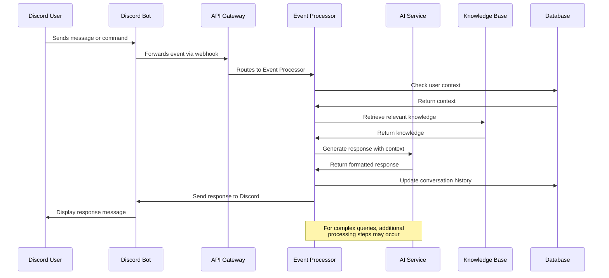

#### Authentication & Setup

-   OAuth2 flow for bot installation
-   Server-specific configuration and permission setup
-   Role-based access control configuration

#### Event Handling

-   Message creation and update events
-   Channel join/leave events
-   Reaction events for issue tracking

#### Features

-   Thread creation for complex discussions
-   Slash commands for direct interaction with DevrAI
-   Automated welcome messages in designated channels
-   Role assignment based on GitHub contribution history
-   Interactive tutorials triggered via commands
-   Code explanation functionality for shared snippets
-   Documentation search via natural language queries

#### Data Flow

1. Discord webhook sends event to API Gateway
2. Event processor extracts relevant information
3. User context and preferences are retrieved
4. AI Service generates appropriate response
5. Integration service formats and sends response back to Discord

### Slack Integration

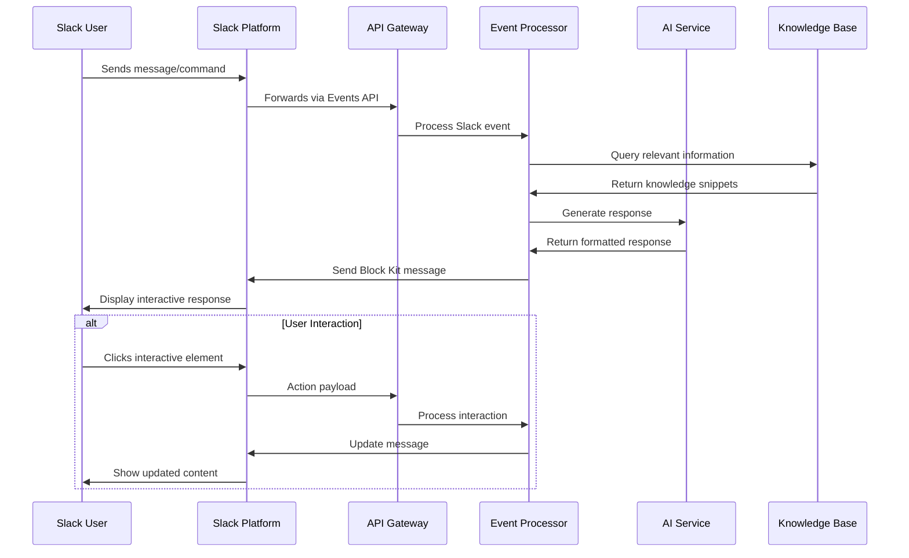

#### Authentication & Setup

-   Slack App Directory installation flow
-   Workspace-specific settings configuration
-   Channel mapping to project components

#### Event Handling

-   Message events in channels and direct messages
-   App mention events
-   Interactive component events (buttons, dropdowns)

#### Features

-   Slash commands for project information
-   Interactive message components for issue triage
-   Automatic daily/weekly project updates
-   Direct message onboarding for new contributors
-   Technical content generation for announcements
-   Documentation search functionality
-   Code assistance and review through file sharing

#### Data Flow

1. Slack Events API sends event to API Gateway
2. Event processor validates and processes the event
3. User context and preferences are retrieved
4. Workflow engine determines appropriate action
5. Response is formatted according to Slack Block Kit
6. Message is sent back to appropriate Slack channel

### GitHub Integration

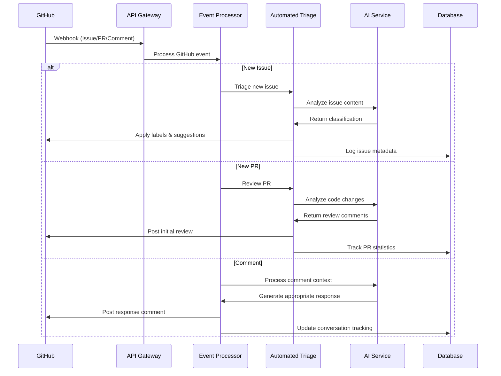

#### Authentication & Setup

-   GitHub App installation process
-   Repository-specific configuration
-   Permission scopes management

#### Event Handling

-   Issue creation, update, and comment events
-   Pull request lifecycle events
-   Repository star and fork events
-   Release publication events

#### Features

-   Automated issue labeling and assignment
-   PR review comments and suggestions
-   Release notes generation
-   Contributor statistics and recognition
-   Documentation suggestions for code changes
-   Sample code generation for issue resolution
-   Quickstart guides based on repository structure

#### Data Flow

1. GitHub webhook sends event to API Gateway
2. Event processor categorizes and enriches event data
3. User context and repository information are retrieved
4. Task is assigned to appropriate service based on event type
5. Response actions are taken via GitHub API
6. Event and action are logged for analytics

### CLI Integration

#### Authentication & Setup

-   API key authentication
-   Repository linking
-   User preference synchronization

#### Event Handling

-   Command execution events
-   Interactive prompts and inputs
-   File system access events

#### Features

-   Direct access to documentation and code examples
-   Interactive tutorials and guided workflows
-   Local environment setup assistance
-   Repository health checks and diagnostics
-   Custom command extension capabilities
-   Contextual help based on current project

#### Data Flow

1. CLI tool sends command to API Gateway
2. Command is processed with user context and repository information
3. Response is generated based on command parameters
4. Results are displayed in the terminal interface
5. User interactions are tracked for personalization

### Web Widget Integration

#### Authentication & Setup

-   JavaScript snippet for website embedding
-   Configuration options for appearance and behavior
-   Anonymous or authenticated user sessions

#### Event Handling

-   Widget activation events
-   User query submissions
-   Interface interaction events

#### Features

-   Documentation search and browsing
-   Contextual help based on current page
-   Question answering capabilities
-   Code example generation and explanation
-   Guided onboarding for new developers
-   Analytics for most common queries and issues

#### Data Flow

1. Widget sends user interaction to API Gateway
2. Page context and user information are included in request
3. Response is generated based on query and context
4. Results are displayed within the widget interface
5. Interactions are logged for analytics and personalization

### Discourse Integration

#### Authentication & Setup

-   API key authentication
-   Category and tag mapping
-   User role configuration

#### Event Handling

-   New topic creation events
-   Post creation and update events
-   User registration events

#### Features

-   Automatic responses to common questions
-   Cross-linking between forum topics and GitHub issues
-   Knowledge base article suggestions
-   Community showcase of project achievements
-   Technical content generation for forum posts
-   Interactive tutorial linking
-   Documentation search capability

#### Data Flow

1. Discourse webhook or API polling detects new content
2. Content is processed and classified
3. User context and preferences are retrieved
4. Knowledge retrieval finds relevant information
5. Response is generated and posted to appropriate thread
6. New knowledge is extracted and stored for future use

## Workflows

### New Contributor Onboarding Workflow

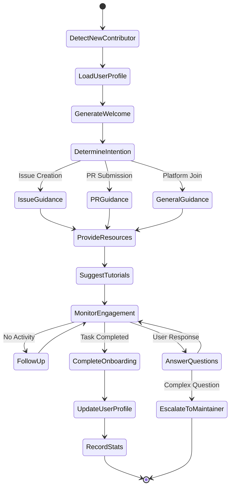

-   **Trigger**: First-time contributor opens an issue or PR, or joins community platform
-   **Detection**: System identifies user as new contributor based on platform history
-   **Personalization**: AI generates personalized welcome message based on:
    -   Contribution type (issue, PR, question)
    -   Project area of interest
    -   Technical background (if available)
    -   Learning preferences
-   **Guidance**: Provides specific next steps based on contribution intent:
    -   Development environment setup instructions
    -   Coding standards and guidelines
    -   Testing requirements
    -   Documentation expectations
    -   Recommended interactive tutorials
-   **Follow-up**: Monitors engagement and provides additional assistance:
    -   Answers to follow-up questions
    -   Escalation to human maintainers when necessary
    -   Check-ins on progress after predefined intervals
    -   Suggestions for additional resources based on progress

### Technical Education Workflow

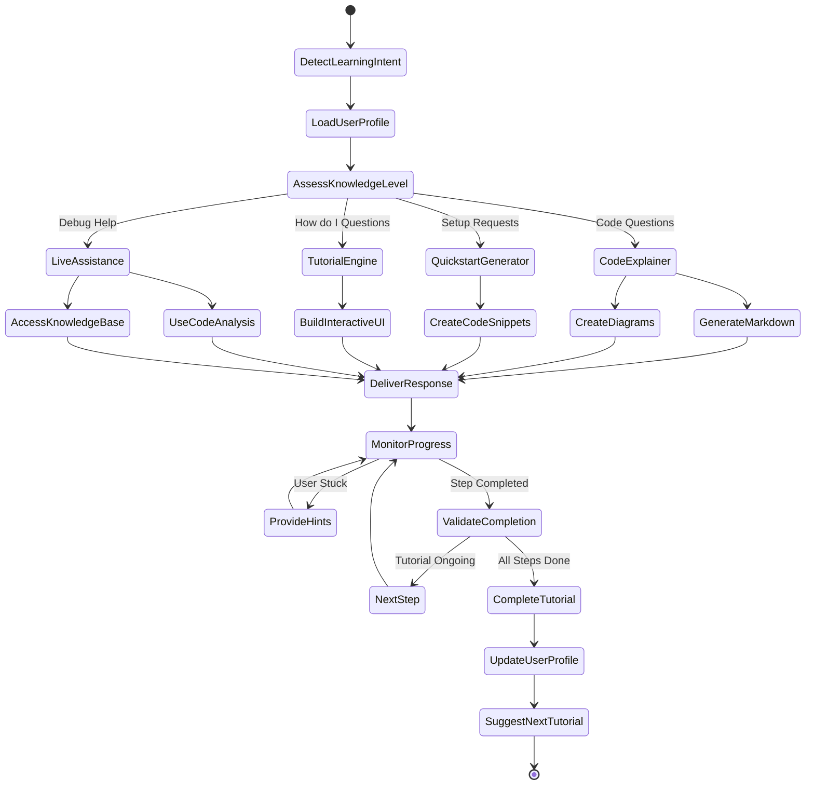

-   **Trigger**: User requests learning resources or system detects learning opportunity
-   **Request Routing**: System routes the request to the appropriate education service:
    -   Code Explainer for code understanding questions
    -   Quickstart Generator for setup assistance
    -   Tutorial Engine for how-to questions
    -   Live Assistance for debugging problems
-   **Content Generation**: Creates personalized educational response:
    -   Markdown explanations with formatted text
    -   Diagrams for visual learners
    -   Code snippets with examples
    -   Interactive UI for hands-on learning
-   **Delivery**: Presents educational content through:
    -   Step-by-step guides in chat interface
    -   Visual aids and diagrams where appropriate
    -   Interactive elements for engagement
-   **Feedback Loop**: Monitors progress and provides assistance:
    -   Real-time validation of exercise completion
    -   Hints when user is stuck
    -   Celebration of milestone achievements
    -   Recording of progress for future sessions

### Content Creation Workflow

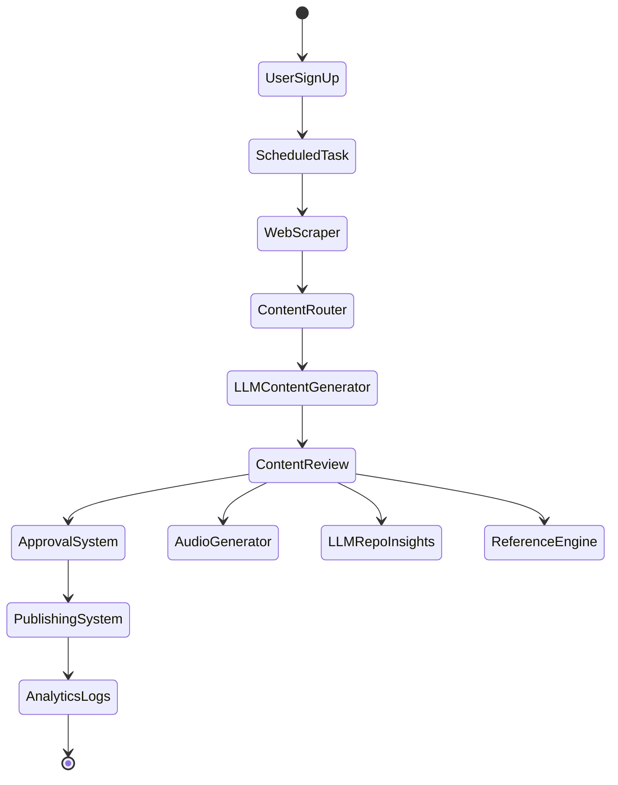

-   **Trigger**: Scheduled content generation task, user signup event, or maintainer request
-   **Content Collection**: Web scraper gathers relevant information from:
    -   Documentation sites
    -   Blog posts
    -   Technical papers
    -   Community discussions
-   **Content Routing**: System categorizes content needs and directs to appropriate generators
-   **Generation**: LLM-based content generator creates appropriate content type:
    -   Technical blog post drafts with code examples
    -   Sample code for various use cases
    -   API documentation with practical examples
    -   Social media announcements with key highlights
-   **Review & Enhancement**: Content undergoes quality checks and enhancements:
    -   Technical accuracy verification
    -   Style and formatting adjustments
    -   Repository insights integration
    -   Reference linking and citation
-   **Output Processing**: Finalized content is prepared for distribution:
    -   Manual or automated approval
    -   Publication to appropriate channels
    -   Audio generation for accessibility
    -   Analytics tracking for performance measurement

### Personalization Workflow

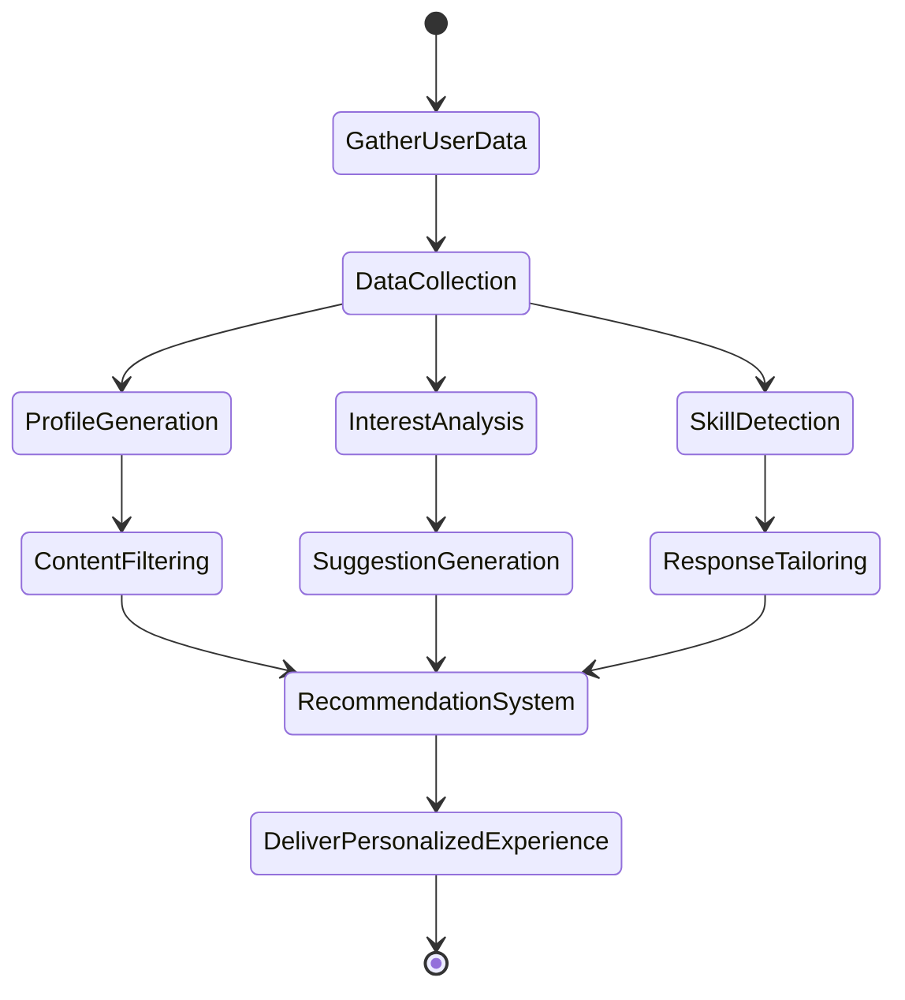

-   **Data Collection**: Gathers user-specific information from various sources:
    -   Interaction history with the system
    -   Developer profile and background
    -   Usage patterns across platforms
    -   Stated preferences and feedback
    -   Geographic location and language
-   **User Modeling**: Processes collected data to build comprehensive user profile:
    -   Technical expertise level determination
    -   Interest area identification
    -   Skill assessment and gap analysis
-   **Content Adaptation**: Customizes interactions based on user model:
    -   Content filtering to match expertise level
    -   Suggestion generation for relevant resources
    -   Response tailoring for communication style
-   **Recommendation System**: Delivers personalized content and assistance:
    -   Content ranking based on relevance
    -   Discovery engine for new resources
    -   Contextual recommendations

### Issue Triage Workflow

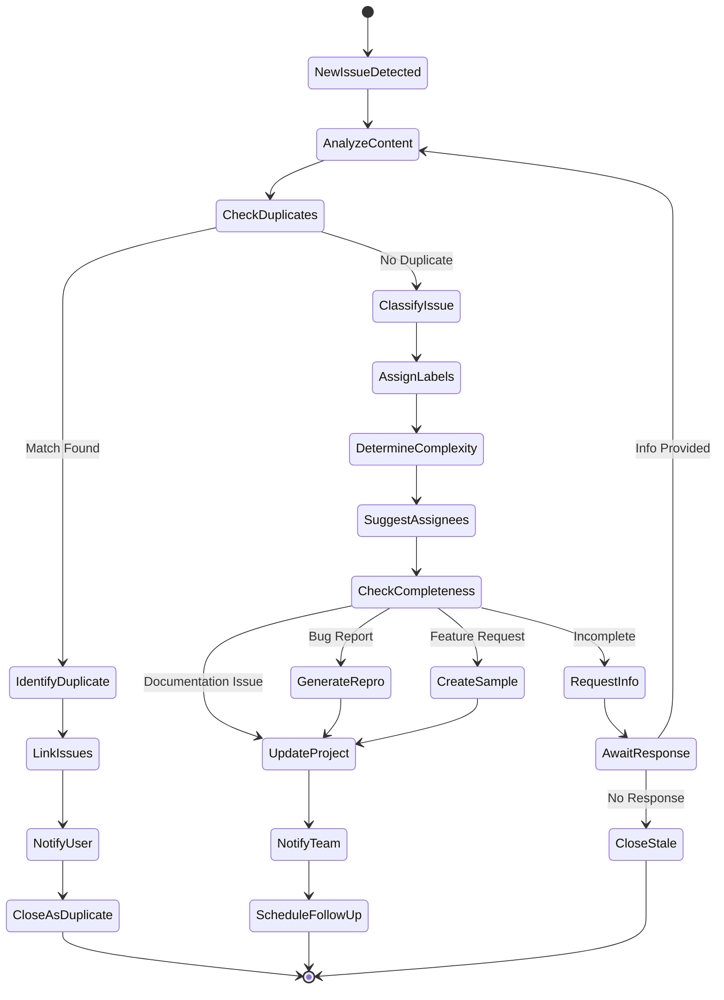

-   **Trigger**: New issue created on GitHub
-   **Analysis**:
    -   AI extracts key information from issue description
    -   Compares with existing issues for duplicates
    -   Identifies affected components and potential severity
-   **Classification**:
    -   Applies appropriate labels (bug, feature, documentation, etc.)
    -   Assigns priority level
    -   Suggests potential assignees based on expertise
-   **Enhancement**:
    -   Requests additional information if description is incomplete
    -   Generates reproduction steps for bug reports when possible
    -   Creates sample code for feature requests to clarify intent
    -   Provides links to relevant documentation
-   **Notification**:
    -   Alerts appropriate team members in Slack/Discord
    -   Updates project boards
    -   Schedules follow-up if issue remains unaddressed

### Knowledge Query Workflow

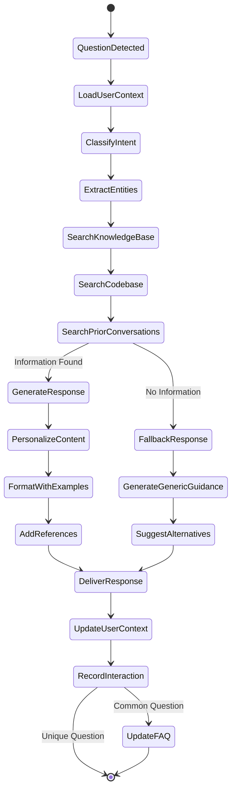

-   **Trigger**: Question asked in any integrated platform
-   **Context Loading**:
    -   Retrieves user's interaction history and preferences
    -   Identifies user's knowledge level and communication style
-   **Intent Recognition**:
    -   Identifies question type and topic
    -   Extracts key entities and concepts
-   **Knowledge Retrieval**:
    -   Searches vector database for semantically similar content
    -   Retrieves relevant documentation and past answers
    -   Examines code repository for relevant examples
-   **Personalization**:
    -   Adapts complexity level to user's expertise
    -   References previous interactions for continuity
    -   Formats response based on user preferences
-   **Response Generation**:
    -   Creates comprehensive yet concise answer
    -   Includes code examples if appropriate
    -   Adds links to official documentation
-   **Knowledge Capture**:
    -   Records question and answer in knowledge base
    -   Updates user context with new information
    -   Updates FAQ if question is common

### Community Analytics Workflow

-   **Data Collection**:
    -   Continuous monitoring of activity across all platforms
    -   Tracking of individual contributor actions
    -   Recording of response times and resolution rates
-   **Processing**:
    -   Aggregation of metrics by timeframe and category
    -   Calculation of derived metrics (e.g., contributor retention)
    -   Trend analysis and anomaly detection
    -   Sentiment analysis of community interactions
-   **Insight Generation**:
    -   Identification of active vs. declining areas
    -   Recognition of valuable contributors
    -   Detection of potential community issues
    -   Assessment of content effectiveness
-   **Reporting**:
    -   Automated weekly summaries to maintainers
    -   Interactive dashboard updates
    -   Quarterly comprehensive project health reports
    -   Content performance analytics
-   **Action Recommendation**:
    -   Suggestions for community engagement improvements
    -   Identification of contributors for recognition
    -   Alerts for areas needing maintainer attention
    -   Content strategy recommendations

## Data Flow and Storage

### Data Collection and Processing

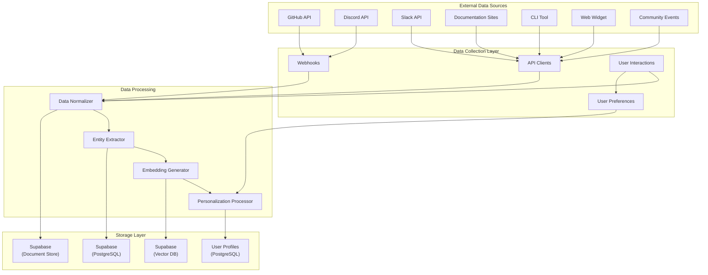

-   **External Data Sources**

    -   Platform APIs (GitHub, Discord, Slack)
    -   Documentation sites
    -   CLI tools and web widgets
    -   Community events
    -   Webhook events
    -   Direct user interactions

-   **Data Transformation**

    -   Normalization of platform-specific data formats
    -   Entity extraction and relationship mapping
    -   Embedding generation for textual content
    -   Personalization processing based on user profiles

-   **Storage Destinations**
    -   Vector embeddings → Supabase
    -   Structured relationships → Supabase
    -   Historical conversations → Supabase
    -   User profiles and preferences → Supabase
    -   Temporary state → Redis

## Deployment Strategy

### Infrastructure Architecture

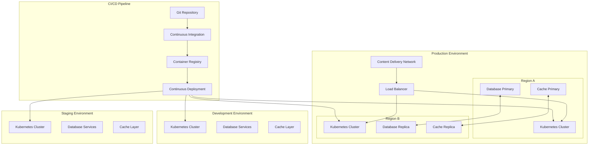

-   **Multi-environment Setup**:

    -   Development environment for active feature development
    -   Staging environment for integration testing
    -   Production environment for live deployment

-   **Containerized Deployment**:

    -   Microservices packaged as Docker containers
    -   Kubernetes for orchestration and scaling
    -   Helm charts for deployment configuration

-   **High Availability Design**:
    -   Multiple replicas of critical services
    -   Cross-zone deployment on cloud provider
    -   Automatic failover mechanisms

### CI/CD Pipeline

-   **Code Integration**:

    -   Pull request validation
    -   Automated code quality checks
    -   Unit test execution

-   **Build Process**:

    -   Docker image building
    -   Image vulnerability scanning
    -   Artifact versioning

-   **Deployment Stages**:

    -   Automated deployment to development
    -   Manual approval for staging promotion
    -   Canary deployment to production
    -   Progressive rollout strategy

-   **Monitoring and Rollback**:
    -   Health check validation post-deployment
    -   Automatic rollback on critical metrics deviation
    -   Deployment audit logging
