# Devr.AI - AI-Powered Developer Relations Assistant

## Table of Contents

-   [Project Overview](#project-overview)
-   [System Architecture](#system-architecture)
-   [Setup Guide](#setup-guide)
-   [Core Features](#core-features)
-   [Technology Stack](#technology-stack)
-   [Integration Details](#integration-details)
-   [Workflows](#workflows)
-   [Data Flow and Storage](#data-flow-and-storage)
-   [Planned Features & Roadmap](#planned-features--roadmap)
-   [Deployment Strategy](#deployment-strategy)

## Project Overview

Devr.AI is an advanced AI-powered Developer Relations (DevRel) assistant designed to revolutionize open-source community management. Currently integrating with Discord and GitHub, Devr.AI functions as a virtual DevRel advocate that helps maintainers engage with contributors, streamline onboarding processes, and deliver real-time project updates.

The system leverages Large Language Models (LLMs), knowledge retrieval mechanisms, and workflow automation to enhance community engagement, simplify contributor onboarding, and ensure that open-source projects remain active and well-supported.

Devr.AI bridges the gap between projects and their developer communities by providing technical education, creating engaging content, facilitating documentation access, and delivering personalized experiences that reduce maintainer workload while improving overall community satisfaction.

### Key Value Propositions

-   **Reduce maintainer workload** by automating routine interactions and queries
-   **Improve contributor experience** through personalized onboarding and support
-   **Enhance project visibility** via consistent engagement and community nurturing
-   **Generate actionable insights** from community interactions and contribution patterns
-   **Ensure knowledge preservation** by capturing and organizing project information
-   **Accelerate developer productivity** with interactive tutorials and code assistance
-   **Strengthen documentation** with AI-powered navigation and custom content generation

## System Architecture

### High-Level Architecture Overview

Devr.AI is built on a **LangGraph agent-based architecture** that replaces traditional centralized LLM approaches with autonomous, reasoning agents that can think, act, and observe. The system follows a **ReAct (Reasoning and Acting) pattern** for intelligent decision-making and tool usage.

#### **Core Architectural Components**

-   **LangGraph Agent System**

    -   **Agent Coordinator**: Central orchestrator that manages agent instances and handles routing between different specialized agents
    -   **DevRel Agent**: Primary conversational agent using ReAct workflow for community support and engagement
    -   **GitHub Toolkit**: Specialized agent for GitHub-specific operations and integrations

-   **ReAct Agent Workflow**

    -   **Gather Context**: Collects user information, conversation history, and platform-specific context
    -   **ReAct Supervisor**: Implements Think → Act → Observe pattern to decide which tools to use
    -   **Tool Execution**: Dynamically selects and executes appropriate tools (web search, FAQ, onboarding, GitHub operations)
    -   **Generate Response**: Synthesizes tool results into coherent, contextual responses
    -   **Summarization**: Maintains long-term conversation memory and context preservation

-   **Asynchronous Processing**

    -   **RabbitMQ Message Queue**: Handles high-throughput message processing with priority-based queuing
    -   **Queue Workers**: Multiple worker processes for parallel message handling and agent coordination
    -   **Background Tasks**: User profiling, verification flows, and maintenance operations

-   **AI Services Integration**

    -   **Google Gemini**: Primary LLM for reasoning, response generation, and conversation management
    -   **Tavily Search API**: Real-time web search and information retrieval
    -   **Text Embeddings**: Semantic search and knowledge retrieval from vector storage

-   **Platform Integrations**

    -   **Discord Bot**: Real-time community engagement with command support and conversation threads
    -   **GitHub Integration**: Webhook processing, issue triage, and repository analysis

-   **Data Storage Architecture**

    -   **Supabase (PostgreSQL)**: User profiles, authentication, conversation metadata, and structured data
    -   **Weaviate Vector Database**: Semantic search, embeddings storage, and knowledge retrieval
    -   **Agent Memory Store**: Persistent conversation context and user interaction history

-   **Authentication & User Management**
    -   **GitHub OAuth Integration**: User verification and repository access
    -   **Supabase Authentication**: Session management and user account linking
    -   **Multi-platform Identity**: Unified user profiles across Discord and GitHub

## Core Features

### 1. LangGraph Agent-Based Intelligence

-   **ReAct Reasoning Pattern**

    -   Think → Act → Observe workflow for intelligent decision making
    -   Dynamic tool selection based on conversation context
    -   Iterative problem-solving with self-correction capabilities

-   **Conversational Memory**

    -   Persistent conversation context across Discord sessions
    -   Automatic summarization after 15+ interactions or timeout
    -   Long-term user relationship building with topic tracking

-   **Multi-Tool Orchestration**
    -   Web search integration via Tavily for real-time information
    -   FAQ knowledge base for common questions
    -   GitHub toolkit for repository-specific assistance (basic implementation)
    -   Onboarding flows for new community members

### 2. Discord Community Integration

-   **Intelligent Message Processing**

    -   Real-time classification of messages requiring AI intervention
    -   Context-aware responses based on conversation history
    -   Background processing via RabbitMQ for scalable message handling

-   **GitHub Account Verification**

    -   OAuth-based GitHub account linking for enhanced personalization
    -   Automatic user profiling with repository and contribution analysis
    -   Secure verification flow with time-limited tokens

-   **Command Interface**
    -   `!verify_github` for account linking and verification
    -   `!verification_status` to check current account status
    -   `!reset` for conversation memory management
    -   `!help_devrel` for command assistance and bot capabilities

### 3. Advanced Data Management

-   **Multi-Database Architecture**

    -   Supabase (PostgreSQL) for structured user data and authentication
    -   Weaviate vector database for semantic search and embeddings
    -   Integrated data flow between relational and vector storage

-   **User Profiling & Analytics**

    -   Comprehensive GitHub profile analysis (repositories, languages, contributions)
    -   Semantic user modeling stored in vector format for intelligent matching
    -   Cross-platform identity linking (Discord ↔ GitHub integration)

-   **Conversation Intelligence**
    -   Persistent conversation context with automatic summarization
    -   Topic extraction and conversation pattern analysis
    -   Memory management with configurable retention policies

### 4. Scalable Infrastructure & Processing

-   **Asynchronous Message Processing**

    -   RabbitMQ message queue with priority-based processing
    -   Multiple worker processes for parallel task execution
    -   Graceful error handling and message acknowledgment

-   **Agent Coordination Framework**

    -   Central coordinator managing multiple specialized agents
    -   LangGraph state management with persistent checkpointing
    -   Dynamic routing between DevRel and GitHub toolkit agents

-   **Real-Time Response Generation**
    -   Google Gemini integration for natural language understanding
    -   Context-aware response personalization
    -   Platform-specific formatting and delivery optimization

## Planned Features & Roadmap

### Upcoming Integrations

-   **Slack Workspace Integration**
    -   Block Kit interactive components
    -   Workflow automation for technical announcements
    -   Channel-specific DevRel agent configurations

-   **CLI Tool Integration**
    -   Command-line interface for developers
    -   Local environment integration
    -   Repository health checks and diagnostics

-   **Web Widget Integration**
    -   Embeddable chat widget for documentation sites
    -   Real-time assistance for website visitors
    -   Seamless handoff to Discord/GitHub

### Enhanced GitHub Features

-   **Advanced Issue Triage**
    -   Automated issue labeling and assignment
    -   Duplicate detection and linking
    -   Priority classification

-   **Pull Request Assistance**
    -   Review comment suggestions
    -   Code quality analysis
    -   Automated testing recommendations

-   **Repository Analytics**
    -   Contributor statistics and recognition
    -   Health monitoring and insights
    -   Release notes generation

### Content Creation & Education

-   **Technical Content Generation**
    -   Blog post drafts with code examples
    -   Social media announcements
    -   Tutorial creation assistance

-   **Interactive Learning**
    -   Step-by-step coding tutorials
    -   Live debugging assistance
    -   Skill assessment and personalized learning paths

-   **Documentation Enhancement**
    -   AI-powered documentation generation
    -   Contextual help integration
    -   Knowledge gap identification

### Advanced Analytics

-   **Community Health Metrics**
    -   Engagement trend analysis
    -   Contributor retention insights
    -   Sentiment monitoring

-   **Performance Analytics**
    -   Response time optimization
    -   User satisfaction tracking
    -   Feature usage analytics

## Setup Guide

For installing the project locally refer to the [Installation Guide](./docs/INSTALL_GUIDE.md)

## Technology Stack

### Backend Services

-   **Core Framework**: FastAPI with asynchronous lifespan management
-   **Agent Framework**: LangGraph for multi-agent orchestration
-   **Messaging Queue**: RabbitMQ with `aio-pika` for asynchronous processing
-   **Containerization**: Docker & Docker Compose
-   **Web Server**: Uvicorn ASGI server

### AI & LLM Services

-   **Primary LLM**: Google Gemini (gemini-2.5-flash, gemini-2.0-flash)
-   **Web Search**: Tavily Search API for real-time information retrieval
-   **Text Embeddings**: Sentence Transformers for semantic search
-   **Agent Patterns**: ReAct (Reasoning and Acting) workflow implementation
-   **Memory Management**: LangGraph checkpointing with conversation summarization

### Data Storage

-   **Relational Database**: Supabase (PostgreSQL) for user profiles, auth, and structured data
-   **Vector Database**: Weaviate for semantic search and embeddings storage
-   **Authentication**: Supabase Auth with GitHub OAuth integration
-   **Agent Memory**: Persistent conversation context and state management

### Frontend Components

-   **Landing Page**: React + Vite + TypeScript
-   **Styling**: Tailwind CSS with custom themes
-   **Animations**: Framer Motion for interactive UI
-   **Icons**: Lucide React icon library
-   **Routing**: React Router DOM
-   **Deployment**: Netlify with SPA configuration

### Platform Integrations

-   **Discord**: py-cord (Discord.py v2) with commands and cogs
-   **GitHub**: PyGithub for repository and issue management
-   **User Verification**: GitHub OAuth flow integration
-   **Webhooks**: FastAPI endpoints for platform event handling

### Development & Infrastructure

-   **Language**: Python 3.9+ with type hints
-   **Package Management**: Poetry with pyproject.toml
-   **Environment**: python-dotenv for configuration
-   **Async Operations**: aiohttp, asyncio for concurrent processing
-   **Testing**: pytest for unit and integration tests
-   **Code Quality**: flake8, autopep8, isort for code formatting

### Monitoring & Observability

-   **Tracing**: LangSmith integration for agent workflow tracing
-   **Health Checks**: Built-in health endpoints for system monitoring
-   **Logging**: Structured logging with configurable levels
-   **Error Handling**: Comprehensive exception management in agent flows

## Integration Details

### Discord Integration

#### Current Implementation

-   **Discord Bot Framework**: py-cord (Discord.py v2) with modern async/await patterns
-   **Command System**: Discord Cogs architecture for modular command organization
-   **Message Processing**: Real-time classification and intelligent routing
-   **Memory Management**: Thread-based conversation persistence with user context

#### Bot Commands

-   **`!verify_github`**: Initiates GitHub OAuth verification flow
-   **`!verification_status`**: Checks GitHub account linking status
-   **`!reset`**: Clears conversation thread memory
-   **`!help_devrel`**: Shows available commands and bot capabilities

#### Features

-   **Intelligent Classification**: Determines which messages need AI processing vs simple responses
-   **Thread Management**: Creates conversation threads for complex discussions
-   **User Verification**: GitHub account linking for enhanced personalization
-   **Context Preservation**: Maintains conversation history across sessions
-   **Background Processing**: Asynchronous message handling via RabbitMQ
-   **Error Handling**: Graceful degradation with user-friendly error messages

#### Data Flow

1. Discord bot receives message or command using py-cord event handlers
2. Classification router determines if DevRel agent processing is needed
3. Messages requiring AI processing are queued via RabbitMQ with priority
4. Agent Coordinator creates AgentState and invokes appropriate LangGraph agent
5. DevRel Agent executes ReAct workflow (gather context → think → act → respond)
6. Response is queued back to Discord bot for delivery
7. Conversation state and user interactions are persisted to databases

### Slack Integration

#### Authentication & Setup

-   Slack App Directory installation flow
-   Workspace-specific settings configuration
-   Channel mapping to project components

#### Event Handling

-   Message events in channels and direct messages
-   App mention events
-   Interactive component events (buttons, dropdowns)

#### Features

-   Slash commands for project information
-   Interactive message components for issue triage
-   Automatic daily/weekly project updates
-   Direct message onboarding for new contributors
-   Technical content generation for announcements
-   Documentation search functionality
-   Code assistance and review through file sharing

#### Data Flow

1. Slack Events API sends event to API Gateway
2. Event processor validates and processes the event
3. User context and preferences are retrieved
4. Workflow engine determines appropriate action
5. Response is formatted according to Slack Block Kit
6. Message is sent back to appropriate Slack channel

### GitHub Integration

#### Authentication & Setup

-   GitHub App installation process
-   Repository-specific configuration
-   Permission scopes management

#### Event Handling

-   Issue creation, update, and comment events
-   Pull request lifecycle events
-   Repository star and fork events
-   Release publication events

#### Features

-   Automated issue labeling and assignment
-   PR review comments and suggestions
-   Release notes generation
-   Contributor statistics and recognition
-   Documentation suggestions for code changes
-   Sample code generation for issue resolution
-   Quickstart guides based on repository structure

#### Data Flow

1. GitHub webhook sends event to API Gateway
2. Event processor categorizes and enriches event data
3. User context and repository information are retrieved
4. Task is assigned to appropriate service based on event type
5. Response actions are taken via GitHub API
6. Event and action are logged for analytics

### CLI Integration

#### Authentication & Setup

-   API key authentication
-   Repository linking
-   User preference synchronization

#### Event Handling

-   Command execution events
-   Interactive prompts and inputs
-   File system access events

#### Features

-   Direct access to documentation and code examples
-   Interactive tutorials and guided workflows
-   Local environment setup assistance
-   Repository health checks and diagnostics
-   Custom command extension capabilities
-   Contextual help based on current project

#### Data Flow

1. CLI tool sends command to API Gateway
2. Command is processed with user context and repository information
3. Response is generated based on command parameters
4. Results are displayed in the terminal interface
5. User interactions are tracked for personalization

### Web Widget Integration

#### Authentication & Setup

-   JavaScript snippet for website embedding
-   Configuration options for appearance and behavior
-   Anonymous or authenticated user sessions

#### Event Handling

-   Widget activation events
-   User query submissions
-   Interface interaction events

#### Features

-   Documentation search and browsing
-   Contextual help based on current page
-   Question answering capabilities
-   Code example generation and explanation
-   Guided onboarding for new developers
-   Analytics for most common queries and issues

#### Data Flow

1. Widget sends user interaction to API Gateway
2. Page context and user information are included in request
3. Response is generated based on query and context
4. Results are displayed within the widget interface
5. Interactions are logged for analytics and personalization

### Discourse Integration

#### Authentication & Setup

-   API key authentication
-   Category and tag mapping
-   User role configuration

#### Event Handling

-   New topic creation events
-   Post creation and update events
-   User registration events

#### Features

-   Automatic responses to common questions
-   Cross-linking between forum topics and GitHub issues
-   Knowledge base article suggestions
-   Community showcase of project achievements
-   Technical content generation for forum posts
-   Interactive tutorial linking
-   Documentation search capability

#### Data Flow

1. Discourse webhook or API polling detects new content
2. Content is processed and classified
3. User context and preferences are retrieved
4. Knowledge retrieval finds relevant information
5. Response is generated and posted to appropriate thread
6. New knowledge is extracted and stored for future use

## Workflows

### LangGraph Agent Workflow (ReAct Pattern)

The LangGraph Agent Workflow implements a **ReAct (Reasoning and Acting) pattern** that enables the AI to think before acting and observe results to make informed decisions.

#### **Workflow Phases**

-   **Message Processing**
    -   Platform messages (Discord, GitHub, etc.) are received and classified
    -   Classification triage determines if DevRel agent intervention is needed
    -   Qualified messages are queued with appropriate priority

-   **Agent Initialization**
    -   Agent Coordinator creates initial AgentState with user context
    -   Session management handles conversation continuity and memory
    -   DevRel Agent begins processing with conversation history

-   **Context Gathering**
    -   Collects user profile information and interaction history
    -   Loads previous conversation summary and key topics
    -   Prepares platform-specific context for decision making

-   **ReAct Loop (Think → Act → Observe)**
    -   **Think**: Supervisor analyzes current context and determines next action
    -   **Act**: Executes selected tool (web search, FAQ lookup, onboarding, GitHub operations)
    -   **Observe**: Reviews tool results and updates conversation context
    -   Loop continues until sufficient information is gathered or max iterations reached

-   **Response Generation**
    -   Synthesizes all gathered information into a coherent response
    -   Personalizes response based on user profile and conversation history
    -   Applies platform-specific formatting (Discord embeds, GitHub comments, etc.)

-   **Memory Management**
    -   Checks if conversation summarization is needed (after 15+ interactions or timeout)
    -   Creates compressed conversation summaries for long-term memory
    -   Updates user profile with new topics and interaction patterns

-   **Response Delivery**
    -   Queues response message for appropriate platform
    -   Handles platform-specific delivery mechanisms
    -   Tracks delivery status and error handling

### GitHub Verification Workflow

#### **GitHub Integration Process**

-   **Discord Command Integration**
    -   `!verify_github` command initiates OAuth flow
    -   `!verification_status` checks current account linking status
    -   Background token cleanup prevents expired verification sessions

-   **OAuth Verification Flow**
    -   Creates temporary verification session with expiring tokens
    -   Generates GitHub OAuth URL with state parameter for security
    -   Sends private message to user with verification instructions

-   **Account Linking**
    -   Validates OAuth callback with authorization code
    -   Links GitHub account to Discord user in Supabase database
    -   Prevents duplicate account associations

-   **User Profiling**
    -   Asynchronously fetches GitHub user data, repositories, and pull requests
    -   Analyzes programming language usage across repositories
    -   Stores comprehensive user profile in Weaviate for semantic search

-   **Data Persistence**
    -   User profiles stored in Supabase for structured queries
    -   Conversation context maintained for cross-session continuity
    -   Vector embeddings in Weaviate for intelligent recommendations

### Technical Education Workflow

-   **Trigger**: User requests learning resources or system detects learning opportunity
-   **Request Routing**: System routes the request to the appropriate education service:
    -   Code Explainer for code understanding questions
    -   Quickstart Generator for setup assistance
    -   Tutorial Engine for how-to questions
    -   Live Assistance for debugging problems
-   **Content Generation**: Creates personalized educational response:
    -   Markdown explanations with formatted text
    -   Diagrams for visual learners
    -   Code snippets with examples
    -   Interactive UI for hands-on learning
-   **Delivery**: Presents educational content through:
    -   Step-by-step guides in chat interface
    -   Visual aids and diagrams where appropriate
    -   Interactive elements for engagement
-   **Feedback Loop**: Monitors progress and provides assistance:
    -   Real-time validation of exercise completion
    -   Hints when user is stuck
    -   Celebration of milestone achievements
    -   Recording of progress for future sessions

### Content Creation Workflow

-   **Trigger**: Scheduled content generation task, user signup event, or maintainer request
-   **Content Collection**: Web scraper gathers relevant information from:
    -   Documentation sites
    -   Blog posts
    -   Technical papers
    -   Community discussions
-   **Content Routing**: System categorizes content needs and directs to appropriate generators
-   **Generation**: LLM-based content generator creates appropriate content type:
    -   Technical blog post drafts with code examples
    -   Sample code for various use cases
    -   API documentation with practical examples
    -   Social media announcements with key highlights
-   **Review & Enhancement**: Content undergoes quality checks and enhancements:
    -   Technical accuracy verification
    -   Style and formatting adjustments
    -   Repository insights integration
    -   Reference linking and citation
-   **Output Processing**: Finalized content is prepared for distribution:
    -   Manual or automated approval
    -   Publication to appropriate channels
    -   Audio generation for accessibility
    -   Analytics tracking for performance measurement

### Personalization Workflow

-   **Data Collection**: Gathers user-specific information from various sources:
    -   Interaction history with the system
    -   Developer profile and background
    -   Usage patterns across platforms
    -   Stated preferences and feedback
    -   Geographic location and language
-   **User Modeling**: Processes collected data to build comprehensive user profile:
    -   Technical expertise level determination
    -   Interest area identification
    -   Skill assessment and gap analysis
-   **Content Adaptation**: Customizes interactions based on user model:
    -   Content filtering to match expertise level
    -   Suggestion generation for relevant resources
    -   Response tailoring for communication style
-   **Recommendation System**: Delivers personalized content and assistance:
    -   Content ranking based on relevance
    -   Discovery engine for new resources
    -   Contextual recommendations

### Issue Triage Workflow

```mermaid
stateDiagram-v2
    [*] --> NewIssueDetected

    NewIssueDetected --> AnalyzeContent

    AnalyzeContent --> CheckDuplicates
    CheckDuplicates --> IdentifyDuplicate: Match Found
    CheckDuplicates --> ClassifyIssue: No Duplicate

    IdentifyDuplicate --> LinkIssues
    LinkIssues --> NotifyUser
    NotifyUser --> CloseAsDuplicate
    CloseAsDuplicate --> [*]

    ClassifyIssue --> AssignLabels
    AssignLabels --> DetermineComplexity

    DetermineComplexity --> SuggestAssignees
    SuggestAssignees --> CheckCompleteness

    CheckCompleteness --> RequestInfo: Incomplete
    CheckCompleteness --> GenerateRepro: Bug Report
    CheckCompleteness --> CreateSample: Feature Request
    CheckCompleteness --> UpdateProject: Documentation Issue

    RequestInfo --> AwaitResponse
    AwaitResponse --> AnalyzeContent: Info Provided
    AwaitResponse --> CloseStale: No Response

    GenerateRepro --> UpdateProject
    CreateSample --> UpdateProject

    UpdateProject --> NotifyTeam
    NotifyTeam --> ScheduleFollowUp
    ScheduleFollowUp --> [*]

    CloseStale --> [*]
```

-   **Trigger**: New issue created on GitHub
-   **Analysis**:
    -   AI extracts key information from issue description
    -   Compares with existing issues for duplicates
    -   Identifies affected components and potential severity
-   **Classification**:
    -   Applies appropriate labels (bug, feature, documentation, etc.)
    -   Assigns priority level
    -   Suggests potential assignees based on expertise
-   **Enhancement**:
    -   Requests additional information if description is incomplete
    -   Generates reproduction steps for bug reports when possible
    -   Creates sample code for feature requests to clarify intent
    -   Provides links to relevant documentation
-   **Notification**:
    -   Alerts appropriate team members in Slack/Discord
    -   Updates project boards
    -   Schedules follow-up if issue remains unaddressed

### Knowledge Query Workflow

-   **Trigger**: Question asked in any integrated platform
-   **Context Loading**:
    -   Retrieves user's interaction history and preferences
    -   Identifies user's knowledge level and communication style
-   **Intent Recognition**:
    -   Identifies question type and topic
    -   Extracts key entities and concepts
-   **Knowledge Retrieval**:
    -   Searches vector database for semantically similar content
    -   Retrieves relevant documentation and past answers
    -   Examines code repository for relevant examples
-   **Personalization**:
    -   Adapts complexity level to user's expertise
    -   References previous interactions for continuity
    -   Formats response based on user preferences
-   **Response Generation**:
    -   Creates comprehensive yet concise answer
    -   Includes code examples if appropriate
    -   Adds links to official documentation
-   **Knowledge Capture**:
    -   Records question and answer in knowledge base
    -   Updates user context with new information
    -   Updates FAQ if question is common

### Community Analytics Workflow

-   **Data Collection**:
    -   Continuous monitoring of activity across all platforms
    -   Tracking of individual contributor actions
    -   Recording of response times and resolution rates
-   **Processing**:
    -   Aggregation of metrics by timeframe and category
    -   Calculation of derived metrics (e.g., contributor retention)
    -   Trend analysis and anomaly detection
    -   Sentiment analysis of community interactions
-   **Insight Generation**:
    -   Identification of active vs. declining areas
    -   Recognition of valuable contributors
    -   Detection of potential community issues
    -   Assessment of content effectiveness
-   **Reporting**:
    -   Automated weekly summaries to maintainers
    -   Interactive dashboard updates
    -   Quarterly comprehensive project health reports
    -   Content performance analytics
-   **Action Recommendation**:
    -   Suggestions for community engagement improvements
    -   Identification of contributors for recognition
    -   Alerts for areas needing maintainer attention
    -   Content strategy recommendations

## Data Flow and Storage

### Current Data Architecture

#### **Data Processing Pipeline**

-   **Message Ingestion**
    -   Discord bot receives messages and commands via py-cord
    -   Classification router determines processing requirements
    -   Priority-based queuing via RabbitMQ for scalable processing

-   **Agent Processing**
    -   Agent Coordinator manages LangGraph agent lifecycle
    -   DevRel Agent executes ReAct workflow with persistent state
    -   Tool execution results stored in conversation context

-   **Data Persistence**
    -   **Supabase (PostgreSQL)**: User profiles, authentication, conversation metadata
    -   **Weaviate (Vector DB)**: User embeddings, semantic search, knowledge base
    -   **Agent Memory**: Conversation summaries, interaction history, context preservation

#### **Storage Schema**

-   **User Management**
    -   Discord and GitHub account linking
    -   OAuth verification tokens and session management
    -   User preferences and interaction statistics

-   **Conversation Intelligence**
    -   Thread-based conversation context
    -   Automatic summarization for long-term memory
    -   Topic extraction and conversation pattern analysis

-   **Vector Knowledge Base**
    -   User profile embeddings for semantic matching
    -   Repository and contribution analysis
    -   FAQ and knowledge article embeddings for retrieval

## Deployment Strategy

### Infrastructure Architecture

-   **Multi-environment Setup**:

    -   Development environment for active feature development
    -   Staging environment for integration testing
    -   Production environment for live deployment

-   **Containerized Deployment**:

    -   Microservices packaged as Docker containers
    -   Kubernetes for orchestration and scaling
    -   Helm charts for deployment configuration

-   **High Availability Design**:
    -   Multiple replicas of critical services
    -   Cross-zone deployment on cloud provider
    -   Automatic failover mechanisms

### CI/CD Pipeline

-   **Code Integration**:

    -   Pull request validation
    -   Automated code quality checks
    -   Unit test execution

-   **Build Process**:

    -   Docker image building
    -   Image vulnerability scanning
    -   Artifact versioning

-   **Deployment Stages**:

    -   Automated deployment to development
    -   Manual approval for staging promotion
    -   Canary deployment to production
    -   Progressive rollout strategy

-   **Monitoring and Rollback**:
    -   Health check validation post-deployment
    -   Automatic rollback on critical metrics deviation
    -   Deployment audit logging
